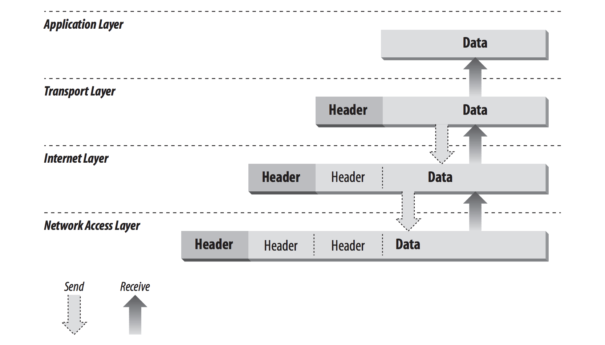
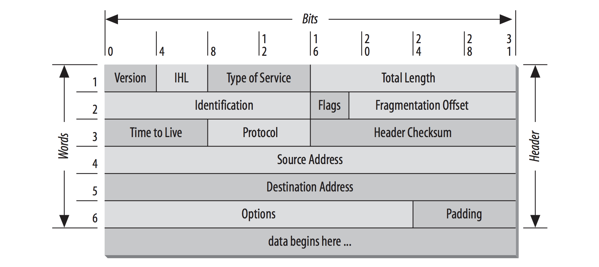
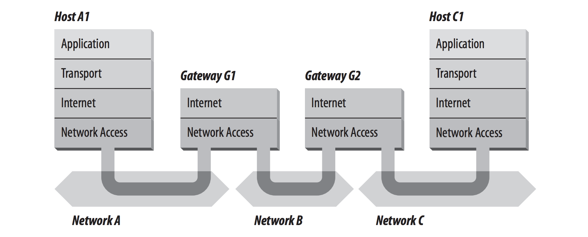
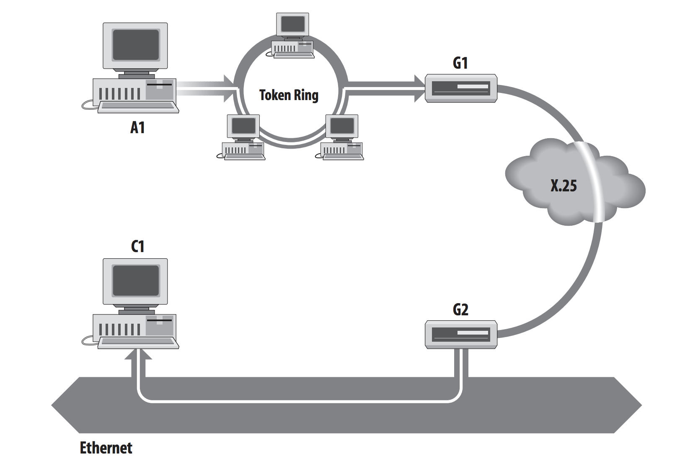
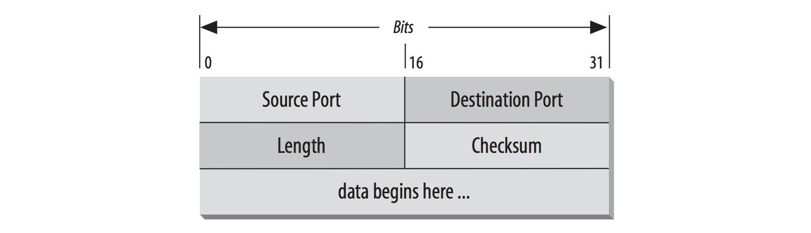
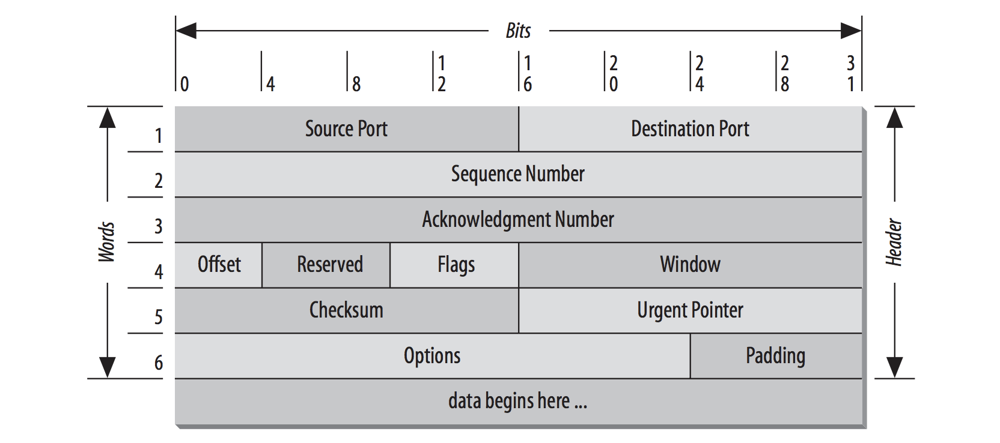
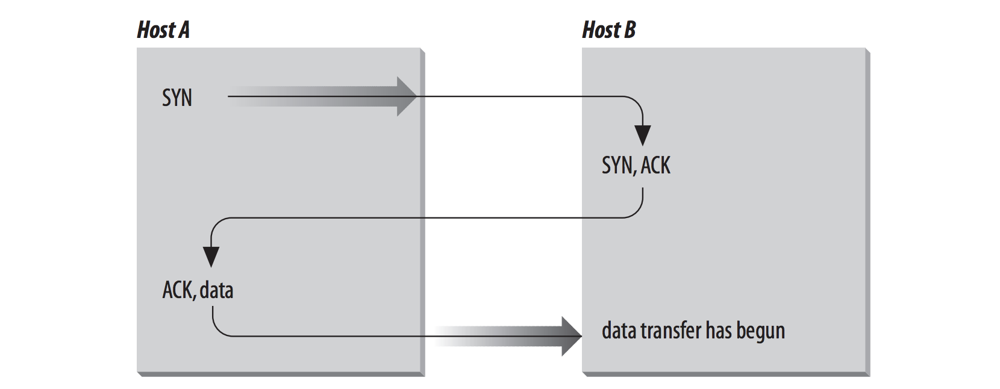
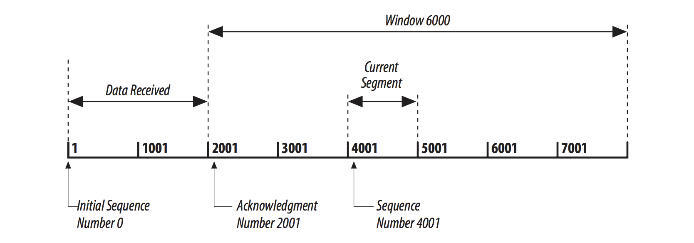
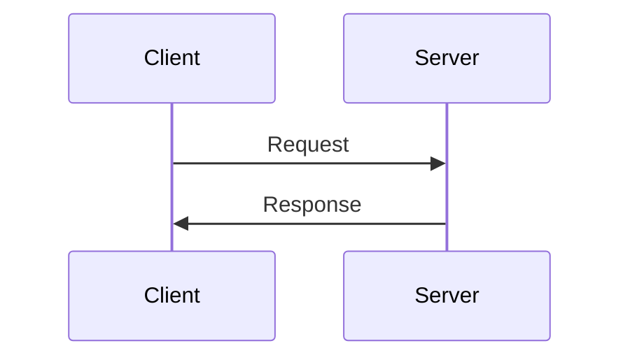
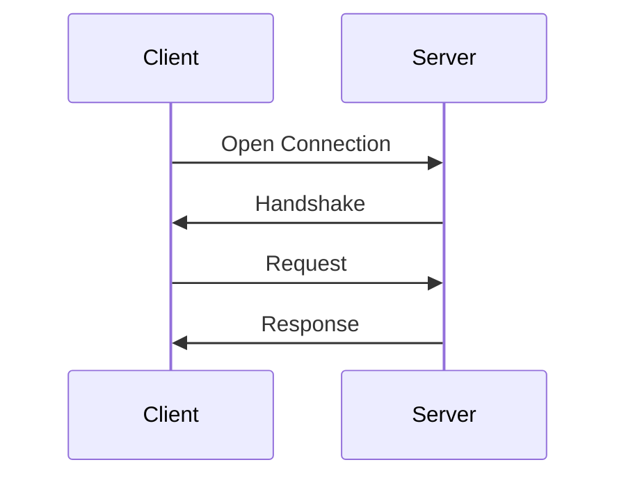

# Overview of TCP/IP

Network administration 跟 System administration 是兩個不同的 job。System administration 的工作像是加入使用者和備份系統。Network administration 系統間的互動，不只要有效率，而且兩邊的系統都要在網路上。

TCP/IP 是一整套資料溝通協定。這套是由兩個協定組成的：Transmission Control Protocol (TCP) 跟 Internet Protocol (IP)。TCP/IP 對這個 protocol suite 來說是一個傳統的名字。TCP/IP protocol suite 又稱作為 Internet Protocol Suite (IPS)。兩個名稱都是可以接受的。

## TCP/IP and the Internet

在 1969 年，Advanced Research Projects Agency (ARPA) 建立了 experimental packet-switching network。又稱作 ARPAnet，提供強大、可靠、vendor-independent 資料的溝通。

現在的 Internet 是由商業提供者所提供。National network provider 又稱作 tier-one provider，然後 regional network provider 建立基礎建設。Internet Service Providers (ISPs) 提供 local access 跟使用者服務。這些 network 會互相連接在數個 major interconnection points，又稱作 Network Access Points (NAPs)。

雖然很多東西改變得很快，不過有一個保持不變的是：Internet 是建立在 TCP/IP protocol suite 之上。

Internet 這個字指的是由 TCP/IP 互相連接的 network。

Internet 的連接需要 TCP/IP。企業內部的網路使用 Internet 的科技用來傳播資訊，又稱作 *intranets*。

### TCP/IP Features

熱門的 TCP/IP protocol 並沒有快速的成長，因為連線的時候需要 Internet 的授權，他們遇到了一個重要的問題，需要一個 worldwide data communication，這裡有幾個功能是他們所需要的：

- 公開的 protocol 標準、自由使用、在不同硬體或系統上能獨立開發。因為這樣能夠廣泛的支援，對不同的硬體跟軟體 TCP/IP 是很理想的，即使你不透過 Internet 通訊。
- 獨立於硬體的網路。允許 TCP/IP 去整和許多不同種類的 network。TCP/IP 可以跑在 Ethernet、DSL connection、dial-up line、optical network、虛擬網路。
- 普遍的 addressing 架構，允許 TCP/IP 在整個網路中連接到特定的設備，即使網路像世界網路一樣大的網路。
- 為了一致性跟廣泛的使用者服務，要標準化更高層的 protocol

### Protocol Standards

Protocol 是行為正式行為規則。在國際的關係，protocol 最小化不同文化之間所導致的問題，如果有不同國家的人同時工作的時候。藉由遵守這些廣為人知的規則，可以最小化誤解，每個人都知道要如何行動，要如何解釋別人的行動。相似的，當電腦在溝通的時候，也必須要定義這些規則去治理他們的通訊。

在資料通訊裡，這組規則又稱作 protocol，在同質網路中，電腦的販售商會使用圖一組的溝通規則在他們的作業系統跟硬體上。同質網路就像是單一個國家一樣，只有國名才能真正地在家。TCP/IP 建立了公開的同質網路 protocol，獨立於作業系統與架構，TCP/IP 能夠讓任何人使用、開發、改變協定、不會歸在任一方製作者。每個人都是自由使用在產品上，
為了找到 open protocol specifications。

開放的 TCP/IP protocol 需要開放的標準程式和公開的文件。Internet standards 由 Internet Engineering Task Force (IETF) 開發，公開的會議且開放。這個 protocol 發佈在 Requests for Comments (RFCs)，正如名稱所表示的，文件內的內容並沒有跟大多數的標準文件一樣嚴謹，RFC 包含各種有趣且有用的信息，並不限於數據通信 protocol 的正式規範。這裡有三個 RFS 基本的型態： standards (STD)、best current practices (BCP)、informational (FYI)。

RFC 定義官方 protocol 標準的 STDs 會給定 STD 的數字。建立官方 Internet 標準是一個嚴謹的過程。在變成標準前，*Standards track* RFCs 會經過三個階段：

- Proposed Standard：已經受足夠的網路社群支援，穩定且廣為人知，但還不足以成為標準而且有可能被丟棄。
- Draft Standard：這個 protocol 規範至少有兩個獨立可操作的成品存在，草稿階段是最終階段前廣泛的測試，只有在測試強迫改變才會變動它。
- Internet Standard：在接收過強度測試後，規範才會成為標準。

有兩個類別的標準：*Technical Specification* (TS) 定義 protocol，*Applicability Statement* (AS) 定義 protocol 什麼時候被使用，有三個級別定義標準的適用性：

- Required：需要 TCP/IP 的某些部分。
- Recommended：應該使用的某些部分，但是不一定需要。
- Elective：選擇性的，取決於軟體開發商。

兩個 requirements levels (*limited use* 跟 *not recommended*)。*limited use* protocol 只會使用在特別的環境，像是正在進行實驗。*not recommended* protocol 是在有限的功能或是過時的時候。有三種 *non-standards track* RFCs：

- Experimental：Experimental RFC 被限制來研究跟開發。
- Historic：Historic RFC 已經過時且不再建議使用
- Informational：Informational RFC 提供了 internet 普遍感興趣的信息，它沒有定義 Internet standard protocol。

Informational RFC 的一個子集合又稱作為 [FYI (For Your Information)](https://tools.ietf.org/html/rfc1150)。FYI 文件提供有關 Internet 和 TCP/IP 網絡的介紹和背景。

另一組超越文件 protocol RFC 是 Best Current Practices (BCP) RFCs。BCP 正式記錄技術和過程。其中一些記錄了 IETF 自身的行為，RFC 2026 就是 BCP 的一個例子。其他人提供網絡或服務運營的指導方針，RFC 1918 Address Allocation for Private Internets 是這種類型 BCP 的一個例子。提供操作指南的 BCP 通常對網絡管理員非常感興趣。

## A Data Communications Model

架構的 model 是由 International Standards Organization (ISO) 所開發的，這個 model 很常被使用來描述結構和資料傳輸 protocol 的功能。這個架構的 model 又稱作為 Open Systems Interconnect (OSI) Reference Model，提供討論通訊的參照。

OSI Reference Model 包含了七 *layers* 定義資料溝通的 protocol。每個 OSI model 的 layer 代表著一個 function，當有資料在網路間傳送的時候會被執行，因為這個 protocol 的 block 會疊在另外一個上，所以這個結構又稱作為 *stack* 或 *protocol stack*。

每個 layer 並不是定義一個單獨的 protocol，它定義資料傳送的功能，且會依照順序執行。因此每個 layer 可能包含多個 protocol，每個 protocol 會提供一個服務適合那一個 layer 的功能。舉例來說，file transfer protocol 跟 electronic mail protocol 兩個都提供使用者服務，而且兩個都是在 Application Layer。

每個 protocol 用 peers 來溝通。*peer* 是在遠端系統同層級相同 protocol 的實現。舉例，像是 local file transfer protocol 是 remote file transfer protocol 的 peer。Peer-level 的溝通必須標準化。在抽象層面，每個 protocol 必須關心的事要如何成功的傳送到他的 peer，他不需要關心上下層的 layer。

這必須在每層之間如何傳送資料作出協議，因為每一層會涉及要如何傳資料，從本地的應用程式傳送到遠端相對等的應用程式，透過底層的網路，上面的 layer 依賴著下面的 layer 來傳送資料，資料會往 stack 下傳，從 layer 傳到另外一個 layer 直到他透過 Physical Layer protocol 傳送為止，在遠端，資料會從 stack 網上傳到應用程式上，每一個 layer 不需要知道上下層有哪些功能，他們只需要知道如何傳送資料給上下層。在不同 layer 隔離網路溝通的功能能最小化影響整個 protocol sutie 的改變。可以不需要改變硬體架構新增應用程式，而且不需要重新改寫應用程式安裝新的網路硬體。

雖然 OSI model 很有用，但是 TCP/IP protocols 沒辦法完整的符合他的結構。因此在討論 TCP/IP，我們會這麼使用 OSI model：

- Application Layer：使用者存取網路的地方，TCP/IP 應用程式是任何執行在 Transport Layer 上的網路程序，它包含使用者可以直接互動的程式，使用者不避意識到他在這層上。
- Presentation Layer：為了與應用程式合作交換資料，必須要知道如何表達資料。在 OSI，Presentation Layer 提供標準資料表達的常規，這個功能常常會由 TCP/IP 裡的應用程式處理，TCP/IP protocols 像是 XDR 跟 MIME 會執行這個功能。
- Session Layer：如同 Presentation Layer，Session Layer 沒辦法在 TCP/IP protocol 架構中成為單獨的一層。OSI Session Layer 管理在兩個合作應用程式的 session (connections)。在 TCP/IP，這個功能大多發生在 Transport Layer。session 這個術語沒有在使用，而是使用 socket 和 port 來描述應用程式溝通的路徑。
- Transport Layer：大多 TCP/IP 所討論的會直接發生在 Transport Layer 的 protocol 上。在 OSI reference model 裡的 Transport Layer 保證接收端獲得資料會跟傳送端完全相同。在 TCP/IP，Transmission Control Protocol (TCP) 運行這個功能，然而 TCP/IP 提供第二個 Transport Layer 的服務：User Datagram Protocol (UDP)，他不會執行端點之間可靠的確認。
- Network Layer：Network Layer 管理跨網路的連線，和從底層的網路隔離上層 layer protocol，Internet Protocol (IP) 從底層網路隔離上層的 layer，然後處理 addressing 跟資料傳遞，IP 常常用來描述 TCP/IP 的 Network Layer。
- Data Link Layer：跨越底層實體網路傳送可靠的資料，會由 Data Link Layer 來處理。TCP/IP 很少在 Data Link Layer 建立 protocols。大多數與 Data Link Layer 相關 RFC 都討論了 IP 如何利用現有的 data link protocol。
- Physical Layer：Physical Layer 定義了攜帶資料傳送信號所需的硬件特性。特性像是電啊、pin 腳介面都會定義在這層。標準的 Physical Layer 介面連接範例像是 RS232C 和 V.35，區域網路 wiring 的標準像是 IEEE 802.3。TCP/IP 不會定義 physical 標準，他使用現有存在的標準。

OSI reference model 術語幫助我們描述 TCP/IP，下一節會介紹 TCP/IP protocol model。

## TCP/IP Protocol Architecture

這並不是普遍的協議 (universal agreement) 描述關於 TCP/IP 如何與分層 model 運作。TCP/IP 普遍會由更少 layer 所組成的。大多數 TCP/IP 的描述在 protocol 架構下定義三到五個階層。在 Department of Defense (DOD) Protocol Model 裡有四層 model，這四層提供了合理的 TCP/IP protocol 架構。

- Application Layer
- Host-to-Host Transport Layer
- Internet Layer
- Network Access Layer

在 stack 中的每個 layer 都會加上控制的訊息，來確保正確傳遞，這個訊息又稱作 *header*，因為在傳送的時候它放在資料的最前面，每個 layer 都會相信從上面接收到的資料，然後把自己的 header 放在最前面，這在每一層叫做 encapsulation，當收到資料的話，他會做相反的動作，資料往上層傳送之前會先把自己的 header 拆掉。

在每一層都有自己的資料結構或自己的術語，每一層都不會意識到他上下層的資料結構。

TCP/IP 在不同層使用不同的術語：

|                      | TCP      | UCP      |
| -------------------- | -------- | -------- |
| Application Layer    | stream   | message  |
| Transport Layer      | segment  | packet   |
| Internet Layer       | datagram | datagram |
| Network Access Layer | frame    | frame    |

每個 Layer 包含很多個 protocol。

## Network Access Layer

*Network Access Layer* 在 TCP/IP protocol 架構中是最底層的，在這層的 protocol 提供系統傳送資料到另一個設備。這層定義要如何使用網路傳送 IP datagram。Network Access Layer 必須知道底層的細節，像是封包的結構、addressing，遵守傳送時正確的格式，TCP/IP Network Access Layer 包含 OSI reference model 三個較底層的功能 (Network, Data Link, and Physical)。

Network Access Layer 通常會被忽略，TCP/IP 的設計會隱藏底層的功能，而較為人所知道 protocol (IP, TCP, UDP) 都是比較高層的 protocol。

功能是執行 IP datagram 封裝到 frame 然後藉由網路傳送，IP address 必須轉換成 physical network 的地址，然後傳送 datagram。

有兩個 RFC 定義 Network Access Layer protocol：

- RFC 826, Address Resolution Protocol (ARP), which maps IP addresses to Ethernet addresses
- RFC 894, A Standard for the Transmission of IP Datagrams over Ethernet Networks, which specifies how IP datagrams are encapsulated for transmission over Ethernet networks

這層通常是結合在硬體 driver 跟相關的程式上。

## Internet Layer

在這一層最重要的協定是 Internet Protocol (IP)，目前所發佈的 IP 版本是 IPv4，被定義在 RFC 791。IPv5 是實驗性的 Stream Transport (ST) protocol，被使用來即時資料的傳送，但沒有操作使用。IPv6 是 IP 的標準，提供很好的擴展功能，因為 IPv6 跟 IPv4 的 address 結構不同，不能用 IPv4 來操作 IPv6，儘管 IPv6 是標準的版本，尚未被廣泛地使用，之後所講的 IP 都是指 IPv4。IPv4 是一個 protocol，是與遠程系統交換資料時，在系統上設定的 protocol，它是本文的重點。

TCP/IP 的核心是 Internet Protocol，IP 提供封包傳送的服務，也是構建 TCP/IP 網絡。IP上方和下方的所有協議都使用Internet協議來傳遞數據。

在 IP 上層跟下層的 protocol 會使用 Internet Protocol 來傳送資料。所有 TCP/IP 的資料都透過 IP 流動，不論最終的目的是什麼。

### Internet Protocol

Internet Protocol 是 Internet 的積木，功能包括：

- 定義 datagram，datagram 是在 Internet 中傳送最基本的單位。
- 定義 Internet addressing scheme。
- 在 Network Access Layer 跟 Transport Layer 之間移動資料。
- Routing datagram 到遠端的 host，
- 執行 fragmentation 跟 re-assembly of datagrams

在描述這些功能前，我們先看一些 IP 的特色。首先，IP 是 *connectless protocol*，這意思是在傳送資料前建立 end-to-end 的連線，不需要交換 control information 又稱 handshake。相反，*connection-oriented protocol* 會與遠端的系統交換 control information，在傳送任何資料前去驗證是否已經準備好接收資料。當 handshake 成功，系統會說已經建立好連線。如果需要 *connection-oriented* 服務的話，Internet Protocol 可以依賴其他 layer 去建立連線。

IP 也需要依賴其他層的 protocol 去提供 error detection 跟 error recovery。Internet Protocol 有時候又稱作 *unreliable protocol* 因為他不包含 error detection 跟 recovery。這並不是說不能依靠這個 protocol，相反，可以依賴 IP 來傳送資料到連線的網路，但不會檢查資料是否正確收到。如果你需要的話，在 TCP/IP 架構其他 layer 的 protocol 會提供這些檢查。

#### The datagram

ARPAnet 是一個 *packet-switching network*，在 ARPAnet 上建立 TCP/IP 去傳送資料。*packet* 是資料的區塊，會攜帶必要的資訊傳送它，很像郵件一樣，信封上面有地址。為了從一個 physical network 交換 packet 到另外一個網路上，packet-switching network 在 packet 裡面使用 addressing 的資訊，來移動 packet 到終點。每個 packet 會獨立遍歷網路。

*datagram* 是由 Internet Protocol 定義的 packet 格式。圖中代表了 IP datagram 的格式。datagram 的前五或六個 32-bit words 是 control information 又稱作 *header*，預設是五個 words 的長度，六個 words 是選擇性的，因為 header 的長度是一個變數，*Internet Header Length* (IHL) 這個欄位會指出 header 長度的 words 數目。header 會包含必要的訊息來傳送封包。

Internet Protocol 藉由檢查 header 第五個 word 的 *Destination Address* 欄位傳遞 datagram。Destination Address 是一個標準的 32-bit IP address，標示目標的 network，和在 network 上具體的 host，如果 Destination Address 在區域網路上 host 的 address，那會直接把 packet 傳到目的地。如果 Destination Address 不是在區域網路上，那會把 packet 傳給 gateway 繼續傳遞。***Gateway* 是在不同兩個網路上交換 packet 的設備**，決定要使用哪個 gateway 又可以稱作 *routing*。IP 會對每一個 packet 做出 routing 的決定。

#### Routing datagrams

Internet *gateways* 通常又被稱為 *IP routers*，因為他們在不同網路間使用 Internet Protocol 去 route packet，在傳統 TCP/IP 行話裡，只有有兩種不同型態的網路設備：*gateway* 跟 *hosts*。gateway 會 forward packet，但是 host 不會。然而，host 連接超過一個 network (又稱作 *multi-homed host*)，這樣就可以在網路間 forward packet，當 multi-homed host 要 forward packet 的時候，所扮演的角色就像其他的 gateway，事實上也會被視為是一個 gateway。前面已經區分 *gateway* 跟 *router* 的術語，但是之後 *gateway* 跟 *IP router* 的術語會混著使用。

Host 是末端的系統 *end system*，擁有四層 protocol layer，然而 gateway 是中介系統 *intermediate system*，只會把封包往上執行到 Internet Layer，然後可以做出 routing 的決定。

系統可以傳遞封包到另外一個設備，這個設備必須要在同一個網路下

系統可傳送 packet 到另一台設備，只要設備連在相同的網路上。Host A1 不需要知道 Gateway G1 後面任何其他的 gateway 的資訊。

這張圖強調的是底層 physical network，datagrame 傳遞的環境可能是不同的，即是不相容：

#### Gragmenting datagrams

route datagram 會經過不同的 network，在 gateway 裡用 IP module 把 datagram 切成更小塊可能是必要的，從 network 收到的 datagram 可能會太大，要以更小的 packet 在不同網路上傳送，這種情況會發生在 gateway 連接著兩個相異的 physical network。

每種不同的 network 都會有一個 *maximum transmission unit* (MTU)，這是 network 可以傳送最大的 packet。如果從 network 上收到的 datagram 超過其他網路的 MTU，datagram 必須被劃分成更小的 *fragments*，這樣才能繼續傳遞，這個過程稱作為 *fragmentation*。想像成火車載著一批鋼鐵，火車所載的鋼鐵比卡車載得多，所以會先卸下火車的負載然後分裝到很多台卡車上。相同的，鐵軌跟高速公路是不同的，相對的，在 Ethernet 的 packet 會被分成更小的 packet 然後傳送到 X.25 network 上。

每個 fragment 的格式跟一般的 datagram 格式是相同的，Header word 2 包含了辨識每個 datagram fragment 的訊息，和提供要如何 re-assemble fragment 回原本 datagram 的訊息，

- Identification 欄位辨識這個 fragment 是屬於哪個 datagram
- Fragmentation Offset 欄位告訴這個 fragment 是 datagram 的哪一塊
- Flags 欄位有 More Fragment 的 bit 可以告訴 IP 是否已經 assemble 完所有 datagram 的 fragments 了

#### Passing datagrams to the transport layer

當 IP 收到的 datagram 地址是 local host 的話，他必須將 datagram 的部分資料傳到正確的 Transport Layer protocol，這會由 datagram header word 3 的 *protocol number* 所完成，每個 Transport Layer protocol 都有一個獨立個 protocol number，可以讓 IP 去辨識這個數字，會在第二章討論。

### Internet Control Message Protocol

IP 整體部分是 *Internet Control Message Protocol* (ICMP) 被定義在 RFC 792。這個 protocol 是 Internet Layer 的一部分，protocol 會使用 IP datagram 傳遞功能，ICMP 會傳送訊息，為 TCP/IP 執行 following control、error reporting、informational function。

- Flow control：當 datagram 太快抵達而無法處理，destination host 或是 intermediate gateway 會傳送 ICMP Source Quench Message 訊息回 sender，這會告訴來源端暫時停止傳送 datagram。
- Detecting unreachable destinations：當目標是 unreachable，系統偵測到問題會傳送 Destination Unreachable Message 給 datagram 的 source 端。如果 unreachable destination 是個 network 或是 host，會由 intermediate gateway 傳送訊息。但如果 destination 是 unreachable port，那 destination host 會傳送訊息。
- Redirecting routes：gateway 會傳送 ICMP Redirect Message 告訴 host 使用另外的 gateway，想必其他的 gateway 是比較好的選擇，可以傳送這個訊息只有在 source host 與兩個 gateway 存在同一個 network 下。假如有一個 host 在 X.25 的網路上，傳送 datagram 到 G1，那他有可能 redirect 到 G2，因為 host、G1、G2 都在相同的 network 上。換句話說，如果 host 在 token ring 上傳送 datagram 到 G1，這樣就沒有辦法 redirect 到 G2，因為 G2 沒有再 token ring 上。
- Checking remote hosts：host 可以傳送 ICMP Echo Message 查看是否遠端系統的 Internet Protocol 是否在運行。當系統收到 echo message，他會回覆訊息，把封包傳回 source host。可以使用`ping`指令。

## Transport Layer

有兩個重要的 protocol 在這層 Layer：

- Transmission Control Protocol (TCP)：TCP 提供可靠的傳送資料，以及 error detection 跟 error correction。
- User Datagram Protocol (UCP)：UDP 提供較低的開銷，connectionless datagram 的傳遞。

這兩個 protocol 都會在 Application Layer 跟 Internet Layer 之間傳送資料，開發人員可以選擇你想要使用服務會比較適合你的應用程式。

### User Datagram Protocol

UDP 給應用程式直接存取 datagram delivery service，就像是 IP 提供的 delivery service。這允許應用程式以最小 protocol 消耗在 network 上交換訊息。

UDP 是 unreliable, connectionless datagram protocol。unreliable 意味著 protocol 上不會有東西去檢驗資料傳到網路另一端正確的順序，在你電腦裡，UDP 只會正確的輸出資料。UDP 在 header word 使用 *Source Port* 跟 *Destination Port* 將資料傳遞到正確的應用程式：

為什麼會想要選擇 UDP 做為資料的傳送呢？這裡有幾個好原因，如果傳送大量的小資料，建立連線且確保可靠傳輸的開銷可能會比整個資料重新傳送來得好，在這個例子，UDP 就是 Transport Layer protcol 中最有效率的選擇。符合 *query-response* model 的應用程式使用 UDP 也是很棒的選擇，response 可以使用 postive acknowledgment 回傳對應的 query，仍然有其他應用程式能使用自己的技術，做到不需要 Transport Layer protocol 就能可靠的資料傳遞，因為加在其他 Layer 上的應用程式是很沒有效率的。

### Transmission Control Protocol

需要 transport protocol 提供可靠資料傳輸的應用程式會使用 TCP，因為他會驗證資料的正確跟順序，TCP 是 *reliable*、*connection-oriented*、*byte-stream* 的 protocol。

TCP 提供可靠的機制叫做 *Positive Acknowledgment with Retransmission* (PAR)，如果沒有聽到遠端系統說資料已經收到的話，就會使用 PAR 再次傳送資料。在 TCP module 互相交換的資料單位又稱作 *segment*，每個 segment 又包含了 checksum，用來辨識收到的資料是完整的。如果沒有收到損壞的 segment，那 receiver 會發出 *positive acknowledgment* 回去給 sender。如果是損壞的 segment，receiver 會丟棄它，等一段適當的時間 timeout，sender TCP module 會重新傳送那個沒有收到 postive acknowledgment 的 segment。

TCP 是 connection-oriented，他會在兩個通訊的 host 建立有邏輯的 end-to-end connection。在傳送資料前，兩個末端交換 control information 又稱作  *handshake* 來建立對話。在 segment header word 4 的 Flags 欄位設定正確的 bit，TCP 就能表示 segment 的 conttrol function。

TCP 使用這種 handshake 的類型又稱作為 *three-way handshake* 因為交換三個 segment。下面的圖是簡單的 three-way handshake 的形式。Host A 傳送給 Host B 一個 segment，segment 上帶有 *Synchronize sequence number* (SYN) 的 bit ，Host A 開始連線到 Host B，這個 segment 告訴 Host B 說 Host A 想要建立連線，而且也會告訴 Host B 說 Host A 開始使用 segment 的 sequence number，sequence number 用來保持資料正確的順序。Host B 回傳給 Host A 的 segment 帶有 Acknowledgment (ACK) 跟 SYN 的 bit，Host B 的 segment 確認收到 Host A 的 segment，且通知 Host A 說 Host B 開始使用的 sequence number。最後，Host A 傳送 segment 確認收到 Host B 的 segment，且傳送第一筆資料。

在這個交換之後，Host A 的 TCP 有積極的證據說遠端的 TCP 是存活的而且準備接收資料，只要連線被建立，資料就可以開始傳，當 cooperating modules 已經傳送完資料了，為了關閉連線，他們會用 segment 帶有 *No more data from sender* 的 bit (FIN) 去交換 three-way handshake。這就是 end-to-end 的資料交換，在兩個系統上提供有邏輯的連線。

TCP 看到資料是連續的 stream of bytes，而不是獨立的 packet，因此 TCP 小心保持傳送跟收到 bytes 的順序，在 TCP segment header 裡的 Sequence Number 跟 Acknowledgment Number 的欄位會記錄這些 bytes。

TCP 標準文件中，每個系統開始的數字不用是一個特定的數字，每個系統可以選擇一個數字當作他的開始點，為了保持 stream 資料正確，連線端必須知道其他人的初始值。連線的兩端會在 handshake 交換 SYN segment 的時候同步 byte-numbering 的系統。在 SYN segment 裡的 Sequence Number 欄位包含 *Initial Sequence Number* (ISN)，這個數字是 *byte-numbering system* 的起始點，為了安全，ISN 應該要是隨機變數。

從 ISN 開始會給每個 byte of data 數字，第一個 byte 就會是 ISN+1，Sequence Number 會識別 segment 第一個 stream data  byte 是在序列中的哪一個位置。舉例，假如 data stream 第一個 byte 的 sequence number 是 1 (ISN=0)，然後已經傳送 4000 個 bytes，那麼現在這個 segment 第一個 data byte 就會是 byte 4001，Sequence Number 也會是 4001。

Acknowledgment Segment (ACK) 會執行兩個 function： *positive acknowledgment* 跟 *flow control*。acknowledgment 會告訴 sender 已經接收多少資料了，然後 receiver 可以再接收多少資料。Acknowledgment Number 是 receiver 期望下一個接收到 byte 的 sequence number。標準文件說，不需要每個 packet 都回傳各自的 acknowledgment，acknowledgment number 是累積所有 positive acknowledgment 到這個 byte 的數字。舉例，假如第一個 byte 是 1 然後成功傳送了 2000 個 byte，Ackenowledgment Number 就會是 2001。

WIndow 欄位是遠端能夠接受多少 byte 的數字，如果 receiver 能夠接受 6000 多個 byte，那個 window 就會是 6000。window 會告訴 sender，receiver 可以接受這麼多 bytes，只要傳送不超過這個數字的 bytes 的總和，sender 就可以繼續傳送 segments。receiver 可以透過改變 window 的大小控制 sender 傳送的流量。window 是 0 就會告訴 sender 停止傳送，直到收到 non-zero window 的值。

下面的圖，TCP data stream 是從 Initial Sequence Number 0 開始。已經接收到 2000 bytes，所以現在 Acknowledgment Number 是 2001，receiver 的 buffer 空間也足夠接收 6000 個 bytes，所以 window 是 6000。sender 現在正在傳送 Sequence Number 從 4001 開始 1000 個 bytes，雖然 sender 從 2001 之後都沒有收到 acknowledgment，但是還是會繼續傳送資料，只要資料還在 window 內。如果 sender 已經填滿 window，然後又收到之前所傳送的 no acknowledgment，等一段 timeout 的時間和，sender 就會再重新開始傳送第一個 unacknowledged byte。

如果沒有收到後續的 Acknowledgment Number 的話就會重新傳送 byte 2001。這個程序確保在 network 遠端能可靠的接收到資料。

為了傳遞資料，TCP 也會負責從 IP 層接收資料給正確的應用程式，*port number* 16-bit 會用來識別應用程式，資料會被約束在那個應用程式。在 segment header 的第一個 word 裡包含了 *Source Port* 跟 *Destination Port*，正確地將資料傳入和傳出應用程式是 Transport Layer 所在做的一個很重要的部分。

UDP Request/Response Paradigm

TCP Handshake Paradigm

## Application Layer

TCP/IP protocol 最頂層的 的架構是 *Application Layer*，這層會包含所有使用 Transport Layer protocol 去傳送資料的程序：

- Telnet：Network Terminal Protocol，透過網路提供遠端登入。
- FTP：File Transfer Protocol，互動式檔案傳輸。
- SMTP：Simple Mail Transfer Protocol，傳送 email。
- HTTP：Hypertext Transfer Protocol，透過網路傳送網頁。

HTTP、SMTP、FTP、Telnet 都是 TCP/IP 實作的應用程式，其他常見的 TCP/IP 應用程式：

- Domain Name System (DNS)：也稱作 *name service*，將 IP 對應到一個有名字的網路。
- Open Shortest Path First (OSPF)：Routing 是 TCP/IP 運作的核心，使用 OSPF 可以讓 network device 交換 routing 的訊息
- Network File System (NFS)：允許檔案分享在不同的 host 上。

