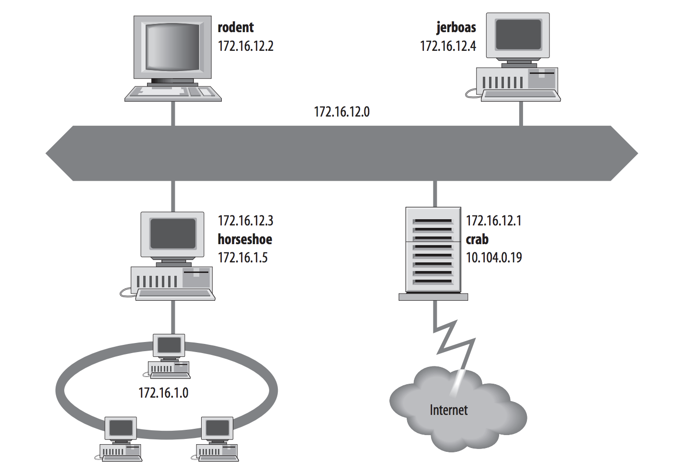
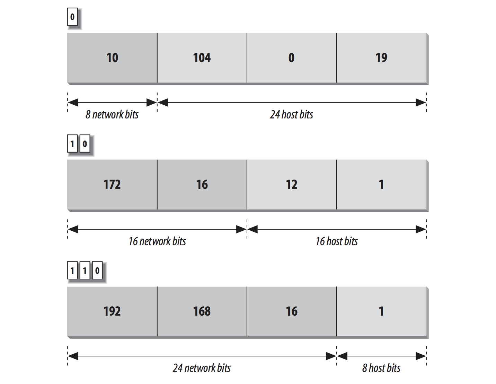
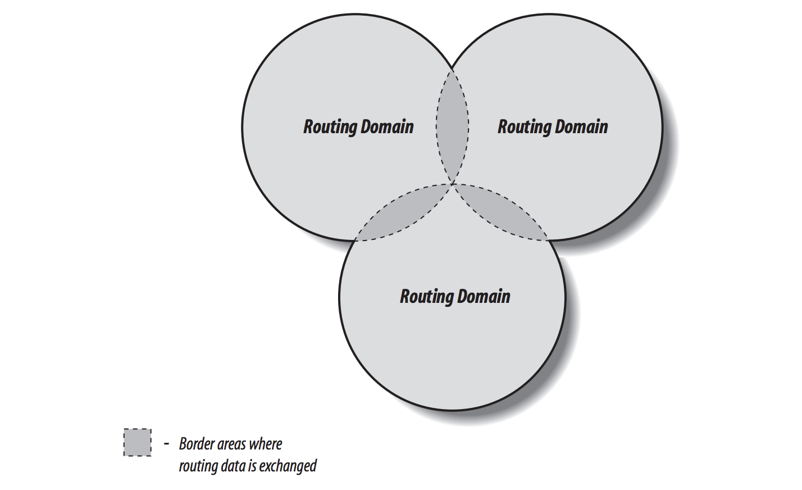
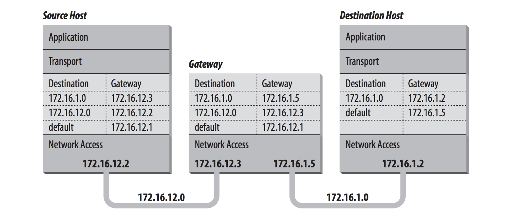
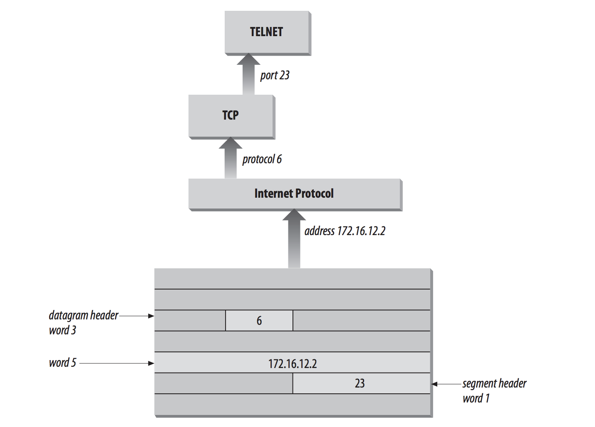
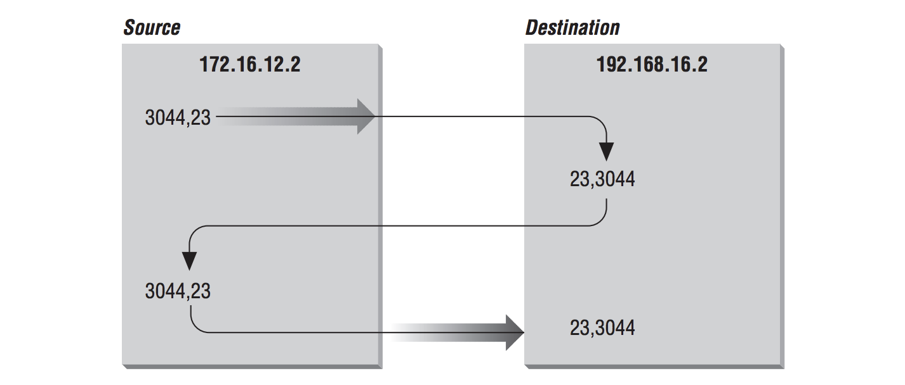

# Delivering the Data

## Addressing, Routing, and Multiplexing

兩個 Internet 的 host 要傳送資料，必須要將資料傳到正確的 host，而且到正確的 user 或 processs。TCP/IP 使用三種 scheme 來完成：

- Addressing：IP address 辨別每個 network 上的 host，傳送資料到正確的 host。
- Routing：Gateway 傳送資料到正確的 network。
- Multiplex：Protocol 和 port number 傳送資料到正確的軟體。

addressing 會在 hosts 之間、routing 會在 networks 之間、multiplexing 會在 layers 之間，應用程式跨越 Internet 傳送茲些資料必須要這些 function。

為了描述這些概念，想像一個企業網路，這是 network 的結構，或是 *topology*：



上面圖示代表：

- rodent：工作站
- crab：gateway 服務的系統
- 粗線：Ethernet
- 橢圓：local network
- 雲：Internet
- 數字：IP address

## The IP Address

IP address 是 32-bit 的值，可以辨識每個 device 上唯一的 TCP/IP network，IP address 通常會用四個 10 進位的數字，用點將四個數字串起來，這個格式又稱作 *dotted decimal notation*，每個 10 進位的數字代表 8-bit byte，每個數字範圍是 0-255。

IP addresses 通常又稱作 host addresses，雖然很頻繁使用，但這會有點誤導。我們會指派 IP addresses 到 network interface 而不是 computer system。像是圖片中 crab 這個 gateway 在不同的連接的 network 上會有不同的 address，就只有另外一台連接同一個 network 的 device 才共享同一個 network，舉例 rodent 透過 172.16.12.1 可以連到 crab，然而 external hosts address 是 10.104.0.19。

有三種方式可以給系統地址：

- host address 會直接 address Individual system，host address 又稱作 *unicast address*，unicast 的 packet 會發往個別的主機。
- 使用 *multicast address* 可以 address 到 Group of system，像是 224.0.0.9。Router 會沿著路徑從 source 到 destination 端辨識特別的地址，Router 會 route packet 的副本到每個 multicast group 內的成員。
- 使用 broadcast 可以 address 在 network 上的 All system，像是 172.16.255.255。broadcast address 會取決於底層 physical netwok broadcast 的能力。

broadcast address 是一個很好的例子，並不能指派所有 network address 或 host address 到 network device。有些 host address 是被保留給特殊的時候使用，在所有 network 上， host number 0 和 255 是被保留的。把 IP address 的 host bits 設成 1 就是 broadcast address，對於 network 172.16 的 braodcast address 是 172.16.255.255，若有 datagram 送到這個 address 就會被傳送到每個 host 是 172.16 的網路上。把 IP address 的 host bits 設成 0 會辨識成 network 自己，舉例來說，10.0.0.0 會指到 network 10，172.16.0.0 會指到 network 172.16，這種形式的 address 是為了用來 routing table 到整個網路。

network address 第一個 byte 的值大於 223 的話，不能指派到 physical network，因為這些 address 是保留給特出時候使用的。還有兩個 network address 也是給特殊目的使用：

- 0.0.0.0 預設目的地是 *default route*，用來簡化 IP 必須處理的 routing 資訊
- 127.0.0.1 是 *loopback address*，允許 local host 也有自己的 address，且跟遠端 host 有相同的行為，簡化 network 的應用程式。

這些 network addresses 在設定 host 上扮演了很重要的角色，但是這些 address 不能被指派到 device 上真正的 network，儘管這些例外，大多數的 address 都可以被指派到 physical device，並且藉由 IP 傳送資料到這些 device。

Internet Protocol 在兩個 host 以 datagram 的形式移動資料，每個 datagram 傳送的地址在 datagram header word 5 的 Destination Address。

### Address Structure

一個 IP address 包含了 *network part* 跟 *host part*，這些 part 的格式在每個 IP address 並不會相同。標識 network 的 address bits 的數量和標識 host 的數字會根據 address 的prefix length 而有所變化。prefix length 會由 address bit mask 所決定。

address bit mask 會像這樣運作：如果在 mask 裡的 bit 是 on，那在 address 裡的這些 bit 等同於 network bit，如果在 mask 裡的 bit 是 off，這些 bit 就會屬於 host address 的一部分。舉例來說，如果地址 172.22.12.4 的 network mask 是 255.255.255.0，前面 24 個 bits 是 on 跟後面 8 的 bits 是 off，前面 24 bits 就會是 network number 跟後面 8 bits 就會是 host address。把 address 跟 mask 結合起來會告訴我們 host address 4 在 network 172.22.12 上。

address 跟 mask 分別用十進位加逗點的方式來寫十分的笨重，有更簡短的方式來寫地址跟 mask，並非寫成 network 172.31.26.32 跟 mask 255.255.255.224，我們可以寫成 172.31.26.32/27，這種符號的格式 `address/prefix-length`，`prefix-length`就是 network address 部分 bit 的數量，有這個符號，address 172.31.26.32 就能輕易的解譯。

可以從 Internet service provider (ISP) 購買一個區塊的 IP address，ISP 通常會指派給組織一組的 address。舉例來說，一個大的公司可能會買 192.168.16.0/20，而小的公司可能會買 192.168.16.32.0/24，因為 prefix 是 network address 的一部分，host address 的數字可以讓組織來使用，host address 的數量可以用所有 bit 數 32 減掉 prefix 的 20 bit，剩下 12 bit 是可以區域使用的，這又稱作 address 的 *12-bit block*。如果 prefix 24 會建立 *8-bit block*。12-bit block 包含了 4096 個 address 從 192.168.16.0 到 192.168.31.255，跟 8-bit block 包含了 256 個 address 從 192.168.32.0 到 192.168.32.255。

每個 address block 讓外部的世界呈現是一個單一的 network address。外部的 router 只需要一個 route 就能到 block 192.168.16.0/20，跟另一個只需要 route 到 192.168.32.0/24 不論這些 address block 的大小。

然而組織內部可能在 address block 裡有數個分離的 physical network。address mark 的彈性意味著 ISP 可以指派任意長度的 block 給他們的客戶，而且客戶可以使用不同長度的 mask 來劃分 address block。

### Subnets

藉由使用 host addresss bits 做為額外的 additional network address bist 來修改 IP address 的結構，實質上，在 network address bits 跟 host addres bist 的劃分線會移動，會建立額外的  network 而不是最大化 host 的數量，這個新設計的 network bit 在更大的 address block 中定義了 address block，又稱作 *subnet*。

組織為了克服 topological 或 organizational 的問題，通常會決定 subnet，subnetting 允許 host address 的分散式管理，使用標準 addressing 的架構，集中式的 administrator 負責管理整個 network 的 host address，藉由 subnet，administrator 可以在廣大的組織內指派 address 給較小的組織，如果你不想要處理資料，像是指派給他們，然後讓他們自己管理。

subnet 也可以用來解決硬體的差異跟距離限制。IP router 可以把不相似的 physical network 連接在一起，但只有在每個 physical network 有他自己唯一的 network address，subnet 會把單一個 address block 劃分成很多唯一的 subnet address，所以每個 physical network 會有自己唯一的 address。

藉由改變 IP address 的 bit mask 來定義 subnet，*subnet mask* 的功能跟 normal address mask 是相同方法：on bit 代表 network bit，off bit 屬於 host address，不同的是，subnet mask 只能在區域使用，在外部，address 仍然會被解譯成外部世界所知的 address mask。

假設你的小公司有 address block 192.168.32.0/24，bit mask 是 255.255.255.0，包含 256 個 address，此外，假設你公司有 10 間辦公室，每間都有 6 台電腦，你會要給每間分配一些 address，然後保留一些給外來拓展使用，你可以用 subnet mask 再劃分 256 address block，subnet mask 藉由加上一些額外的 bit 就能拓展 address network。

為了要再劃分 192.168.32.0/24 變成 16 個 subnets，可以使用 mask 255.255.255.240 像是 192.168.32.0/28。前面三個 byte 包含原本網路的 address block，第四個 byte 被劃分成 subnet address 跟 host address。這樣會建立 16 個 subnet 且包含 14 個 host address：

| Network number | Host address range              | Broadcast address |
| -------------- | ------------------------------- | ----------------- |
| 192.168.32.0   | 192.168.32.1 – 192.168.32.14    | 192.168.32.15     |
| 192.168.32.16  | 192.168.32.17 – 192.168.32.30   | 192.168.32.31     |
| ...            | ...                             | ...               |
| 192.168.32.240 | 192.168.32.241 – 192.168.32.254 | 192.168.32.255    |


第一個 row 的第四個 byte 前四個 bits 是 0，跟最後一個 row 的第四個 byte 的前四個 bits 是 1。原本 RFC 說你不能使用全部都是 0 或 1 的 subnet，然而在 RFC 1812 *Requirements for IP Version 4 Routers* 讓 subnet 全部是 0 或1 的情況合法化，也可以支援所有 router，有些舊的 router 不遠許這種 address，但現在的軟硬體應該都可以可靠的使用 subnet address。

你不需要像這樣手動計算 table 才能知道 subnets 跟 host address，這個已經被計算完成了，在 RFC 1878 *Variable Length Subnet Table For IPv4* 列出所有可能的 subnet mask 跟合法產生的 address。

RFC 1878 描述了所有 32 prefix 的值，但不幸的事，有時候 address 不會給你確切的 address mask，你必須知道要如何決定 natural mask，預設將 address 指派為 natural mask。

### The Natural Mask

原先，IP address 的空間會被劃分成固定長度的結構，稱作 *address classes*。三個主要的 address classes：class A、class B、class C。IP 的軟體藉由檢查 address 前幾個 bits 來決定是哪個 class，address class 不再被使用，但決定 address class 的規則建立預設的 address mask，又稱作 *natural mask*：

- 如果 IP address 第一個 bit 是 0，預設 mask 是 8 bits (prefix 8)，跟舊的 class A network address 格式相同，前 8 bits 辨識 network，後面 24 bits 辨識 host。
- 如果 IP address 前兩個 bit 是 10，預設 mask 是 16 bits (prefix 16)，跟舊的 class B network address 格式相同，前 16 bits 辨識 network，後面 16 bits 辨識 host。
- 如果 IP address 前三個 bit 是 110，預設 mask 是 24 bits (prefix 24)，跟舊的 class C network address 格式相同，前 24 bits 辨識 network，後面 8 bits 辨識 host。
- 如果 IP address 前四個 bit 是 1110，是 multicast address，這些地址有時候會稱作為 *class D* address，但他們不會指派到特定的 network。multicast address 被用來一次分配一群電腦的 address，這群電腦會共同應用程式，像是視訊會議，相對的這群電腦會共享同一個 network，在 multicast address 裡的所有 bits 對於 routing 很重要，所以預設的 mask 是 32 bits (prefix 32)

natural mask 都是由 prefix 8 的倍數組合而成的，簡單決定預設 mask 的方法是看 address 第一個 byte，如果第一個 byte 是：

- 小於 128，預設 address mask 是 8 bits，第一個 byte 是 network，後面三個 byte 是 host address。
- 從 128 到 191，預設 address mask 是 16 bits，前兩個 byte 是 network，後面兩個 byte 是 host。
- 從 192 到 223，預設 address mask 是 24 bits，前三個 byte 是 network，後面一個 byte 是 host。
- 從 224 到 239 是 multicast，整個 address 都會是 multicast group，因此預設 mask 是 32 bits。
- 大於 239 的 address 被保留，我們可以忽略保留的 address。

下圖描述了兩個決定 default address 結構的技術。第一個 address 是 10.104.0.109，這個 address 第一個 bit 是 0，因此，前 8 bits 定義 network，後面 24 bits 定義 host。從 byte-oriented 來解釋的話，第一個 byte 小於 128，所以 address 會被解釋成 host 104.0.19 在 network 10 上。一個 byte 代表 network，三個 byte 代表 host。



因為 IP address 有雙重角色，address mask 的彈性，不只讓更多的 address 能夠使用，還對 routing 有正面的影響。

### CIDR Blocks and Route Aggregation

IP address 提供橫跨所有 Internet 的 network 普遍的 addressing，IP address 是最好的 TCP/IP protocol sutie，然而原本的 IP address 結構很薄弱，TCP/IP 的設計者沒辦法預見現在 network 的龐大規模，當設計 TCP/IP 的時候，network 會受限於龐大電腦系統的大規模組織，每台電腦都有強大 Unix 系統的這種想法並不存在，在當時，32-bit address 已經太大而劃分成 classs 來簡化 router 上的負荷，舉例來說，指派單一個 class B 的 address 而不是六個 class C 的 address 可以建華 router 的負荷，因為 router 只需要對一個組織紀錄一筆 route，然而一個組織被指派 class B 的 address 不代表他們有 64000 台電腦，只是大多數的 host address 沒被使用。

class 結構的 address 設計對於快速成長的網路非常緊張，有一點可以預期的是 class B address 可能快速地被消耗完，class A 會太多，class C 太小，即使 class B address 可能對大多的 network 來說太大，但還是被使用著，因為比起其他選擇來說。

對於 class B address 危機的解決方法是迫使組織使用更多的 class C address，因為有數百萬的 address 可以被使用，所以不會有立即耗盡的危險。每個 class C address 在 routing table 需要自己的 entry，假設有數千或數百萬個 class C address 可能會導致 routing table 成長過快，以至於 router 很快地被淹沒。所以需要一個新的解決方法來查看由 address mask 提供的 address，也需要一個新的指派 address 的方法。

網路在小且集中的 network 中會正常運作，然而他不會把 network topology 記起來，因此 router 隨機選擇是否達到 network 195.4.12.0 跟 network 195.4.13.0 ，這會讓簡化 routing table 變得更加困難。address 只有一個服務內數字是連續的才可以被整合到同相同的 route。舉例，如果 address 對每個服務提供者都是連續的，建立單一個 route 就能整合他，因為服務提供者將會有限的連線數連到網路。但如果一個 network 在法國，下一個連續的網路在澳大利雅，要將這些網址建立一個綜合的 route 是不可能的。

現今，較大連續的 address block 會以比較好映射 network 的 topology 的方式指派給較大的 network service provider。service provider 會把這些 address 的 chunks 分配到他們提供 network 服務的組織，因為指派 address 反應了 network 的 topology，允許整合 route，在這個架構下，我們知道 network 195.4.12.0 跟 network 195.4.13.0 可以透過相同的中介 router 到達，事實上，這兩個 address 都會指派到歐洲，只要在這個範圍內 194.0.0.0 到 195.255.255.255。

指派 address 反應了 network 的拓撲，指派 address 能夠整合 route 但不能實作他，只要 network 195.4.12.0 跟 network 195.4.13.0 會被解譯成 class C 的 address，那他們在 routing table 仍然需要分別的 entry，所以 address mask 的開發，不只增加了可使用的 address 空間，還改進了 routing。

使用 address mask 來決定目的地的 network 稱作為 *Classless Inter-Domain Routing* (CIDR)，而不是舊的 address class，CIDR 需要對 router 和 routing protocol 做修改，這個 protocol 必須分配 address mask 與目標的 address ，address mask 定義這些 address 如何被解譯。router 跟 host 只需要如何解意這些沒有 class 的 address，而且如何應用 bit mask 在 address 上。所有新的作業系統跟 routing protocol 支援 address mask。

CIDR 被視為是臨時的解決方法，但比起設計者所想像的，已經被證實更加的耐用。CIDR 已經緩解了 address 和 routing 很多年，而且能夠提供未來更多年。對於 address 消耗的解決方法是替換成新的 addressing 架構。在 TCP/IP protocol sutie 裡，addressing 被定義在 IP protocol 裡，因此，為了定義一個新的 address 結構， Internet Engineering Task Force (IETF) 建立了新的 IP 版本，叫做 IPv6。

### IPv6

IPv6 改進了 IP protocol 20 年來的經驗，原本的動機是 address 的消耗，IPv6 有 128-bit 所以消耗並不是問題，而且這麼大的 address 也能夠使用階層式的 address 結構來減少 router 的負擔，同時對未來的網路成長，也可以維護足夠的 address，IPv6 的好處有：

- 提高了 protocol 內建的安全性
- 簡單、固定長度、word 對齊 header 增加 header 處理速度、跟減少開銷
- 改進了處理 header options 的技術

儘管 IPv6 有這麼多的功能，但仍然沒有廣泛地使用，因為增強 IPv4、改進硬體效能、跟改變 network 設定，減少了對 IPv6 的需求。

address 的短缺沒有實現有三個原因：

- CIDR 讓 address 更有彈性，CIDR 讓更多的 address 能夠使用跟整合，減少 router 的負擔
- 私人網路跟 NAT 也大幅的減少需求，許多組織喜歡使用私人 address，因為減少管理的負擔跟增加安全性。
- 固定 address 比浮動的 address 更少使用，系統主要使用短暫的浮動 address，透過 DHCP configuration protocol 來指派。

這些對 IPv4 的創新，教訓了 IPv6 安全性改進的需求，事實上，許多 IPv4 安全性的工具跟功能並沒有全面的使用，表明對保護連線工具的需求可能被高估了。

IPv6 消除了 hop-by-hop segmentation，有更有效率的 header 設計，改進處理功能，這些東西讓處理 IPv6 的封包效率高於 IPv4 的封包，然而對於系統全面的增加效能是不需要的，因為處理 IP datagram 是非常小的工作，大多數系統都處在 network 的邊緣，跟處理少數通訊的封包，處理器的速度跟記憶體快速的增加，同時硬體價格下跌，大多數的管理者寧可使用 IPv4 買更多的硬體，也不願意使用新的 IPv6 來承受風險，或是為了省下幾個 machine cycle，只有真正在網路核心附近的系統才會享受到效率的提升，雖然效率的提升很重要，但這些系統也只是相對少數。

集合了這些原因教訓了 IPv6 的需求，需求的短缺限制了組織的數量，缺乏需求減少了採用 IPv6 作為主要通信 protocol 的組織數量，要有一個大的社群，protocol 才會真正的成功，我們使用通訊 protocol 來跟別人通訊，如果沒有足夠的人使用這個 protocol，我們並不會對他的需要，IPv6 仍然在早期採用的階段，大多數組織沒有使用 IPv6，而且會使用它的原因是實驗目的，在組織裡面，大多數 IPv6 的通訊會封裝在 IPv4 datagram 裡面，然後透過 IPv4 的通道傳送，它還需要一段時間才能成為 operational network 主要 protocol。

如果你在使用 operational network，不應過度關注 IPv6，當前的 TCP/IP (IPv4)，以及CIDR 和其他 extensions 提供的增強功能，應該足以滿足你現在的網絡需求。

## Internet Routing Architecture

在原本的 Internet 結構，是一個 gateway 的階層，所有網路都是建立在已經存在的 ARPAnet 上，當 Internet 被建立的時候，ARPAnet 就是 network 的骨幹：集中式傳輸長距離的流量，這個集中式的系統稱作為 *core*，然後集中管理的 gateway 連到 core 又稱作為 *core gateway*

在階層的結構中，所有關於 network  的 routing 資訊都會傳入 core gateway，core gateway 會處理訊息，然後使用 *Gateway to Gateway Protocol* (GGP) 在 gateway 之間交換他，這個處理過的 routing 訊息會再傳到外部的 gateway，core gateway 為整個 Internet 維護精準的 routing 訊息。

使用階層式的 core router model 來分賽 routing 的訊息有一點弱：core 必須處理每個 route。這樣放了一個很大的負擔在 core 上，並且當 Internet 變得更大的時候，負擔也會增加。在 network 的說法，我們說這個 routing model 沒有 **scale well**，基於這個原因，新的 model 出現。

即使在單一的 Internet core，一群獨立的 network 稱作為存在於 core 外部的自主系統，這個詞 *autonomous system* (AS)，在 TCP/IP routing 有一個正式的含義，一個 autonomous system 不只是一個獨立的 network，他是一個 network 和 gateway 的集合，有自己的內部機制，可以收集 routing information 和傳到其他獨立的 network 系統。routing information 傳到其他網路系統又稱作為 *reachability information*，reachability information 簡單說明了，可以透過自主系統 autonomous system 到達哪個網路，在現在單一 Internet core 下，自主系統 autonomous system 會把 reachability information 傳到 core 處理，*Exterior Gateway Protocol* (EGP) 就是一個在自主系統跟 core 間傳送 reachability information 的 protocol。

新的 routing model 是基於互相平等的 autonomous system 集合，又稱作 *routing domains*，routing doamin 會使用 *Border Gateway Protocol (BGP)* 跟其他的 domain 交換 routing information，每個 routing domain 處理他從其他 domain 收到的 information，不想結構的 model，這個 model 不會依賴單一個 core 系統去選擇最好的 route。每個 routing doamin 都會為自己執行這個程序，因此，這個 model 更能擴展，下圖這個 model 使三個互相交錯的圓圈，每個圓圈是一個 routing domain，交錯的地方是 border 區域，這個區域的 routing information 是共享的。這些 domain 共享 information 但不會依賴其中任何一個系統來提供 routing information。

這個 model 的問題是：要如何在全域網路裡決定最好的 route，如果沒有集中式的 routing authority，像是 core，可以信任 core 決定最好的 route。在 NSFNET 這些日子裡，*policy routing database* (PRDB) 曾經被用來決定 autonomous system 所通知的訊息是否是合法的。但現在即使是 NSFNET 也不是扮演著中央的角色。

為了填補這個空缺，NSF 建立了 *Routing Arbiter* (RA) server，server 會建立 *Network Access Points* (NAPs) 為廣大的 service provider 網路提供互相連線的點，route arbiter 位於在每個 NAP 上，server  提供存取 *Routing Arbiter Database* (RADB)，RADB 取代了 PRDB。ISPs 可以請求 server 來檢驗從 autonomous system 通知的 reachability information。

RADB 只是 *Internet Routing Registry* (IRR) 的一部分，為了適合分散式的 routing 架構，有很多組織會檢驗和註冊 routing informatioin，像是歐洲 RIPE NCC 提供歐洲 IP network，大的網路供應商提供客戶 registry，所有 registry 共享同一個 RIPE-181 標準的格式。



許多 ISPs 沒有使用 route server，取而代之的是，他們會依賴一些正式或非正式的雙邊協議，這個協議兩個 ISPs 會合作，然後決定另一邊可以接收到哪個 reachability information。他們建立私人的 routing 政策，小的 ISPs 已經批評 tier-one provider 的這種政策，且聲稱他們限制了競爭對手。大多數 tier-one provider 已經承諾讓政策公開，澄清當前架構清楚，甚至可能會有更多的變化。

## The Routing Table

Gateway 會在 network 之間 route 資料，但所有的 network device，hosts 跟 gateway 必須決定 routing desicion，對大多數的 host，routing decision 是很簡單的：

- 如果 destination host 是在區域網路上，資料傳遞到 destination host。
- 如果 destination host 是在遠端網路上，資料會送往到 local gateway。

IP routing 的決定是簡單的查看 table，封包會按照 *routing table* (或又稱作 *forwarding table*) 的指示 route 向他們的目標，routing table 會把 destination 映射到 router 和 network interface，IP 必須使用  router 和 network interface 到達目的。

在 Linux 上，檢查 routing table，`-n`會不會讓 IP address 轉換成 hostname：

```shell
$ route -n 
Kernel IP routing table
Destination     Gateway         Genmask         Flags Metric Ref    Use Iface
0.0.0.0         140.113.213.33  0.0.0.0         UG    0      0        0 enp3s0
140.113.213.32  0.0.0.0         255.255.255.224 U     0      0        0 enp3s0
172.17.0.0      0.0.0.0         255.255.0.0     U     0      0        0 docker0
172.18.0.0      0.0.0.0         255.255.0.0     U     0      0        0 br-761b4dac69d1
$ route
Kernel IP routing table
Destination     Gateway         Genmask         Flags Metric Ref    Use Iface
default         IP-213-33.cs.nc 0.0.0.0         UG    0      0        0 enp3s0
IP-213-32.cs.nc 0.0.0.0         255.255.255.224 U     0      0        0 enp3s0
172.17.0.0      0.0.0.0         255.255.0.0     U     0      0        0 docker0
172.18.0.0      0.0.0.0         255.255.0.0     U     0      0        0 br-761b4dac69d1
```

- `Destination`：destination IP address 符合的值
- `Gateway`：抵達指定目標的 router
- `Genmask`：將 IP address 與 Destination 欄位的值進行比對的 address mask。
- `Flags`：route 的特徵
  - `U`：route 正在運行
  - `H`：這會 route 到特定的 host (大多情況都會 route 到 network)
  - `G`：這個 route 使用外部的 gateway
  - RDMACLBI!
- `Metric`：route 的費用，如果任何重複的 routes 出現在 table 裡，就會排序重複的 routes，除此之外，還需要 dynamic routing protocol 來作為 metric 的標準。
- `Ref`：route 建立連線的次數。Linux 系統沒有使用這個值。
- `Use`：IP 查找這個 route 的次數。
- `Iface`：這個 route 所使用的 network interface 的名字。

 每個 entry 都是從 *destination value* 開始的，他會用來比對 IP address 的值，決定是否能到達這個 IP address，destination value 通常又稱為 destination network，他不一定是一個 network address，可以是 host address、multicast address、整合許多網路的 address block、特殊的值 default route 或 loopback address。

IP 會從收到的 packet 套用 Genmask 在 destination address 上，去看是否符合 table 裡面的 destination value。

當符合 tabel 裡的 entry，gateway 欄位告訴 IP 要如何達到目的地。如果 Gateway 的欄位包含 router 的 IP address，那就使用這個 router。如果 Gateway 的欄位包含所有 0 (0.0.0.0)，這個 destination network 會是一個直接連線的 network，然後 gateway 是電腦的 network interface。每個 entry 的最後一個欄位是 route 所使用的 network interface。

> destination、gateway、mask、interface 定義了 route。

其他的四個欄位 Flags、Metric、Ref、Use 只是呈現 route 支援的訊息，在不同的作業系統精準度不一樣，有些作業系統還不會使用。Metric 只會運行在某些 Routing Information Protocol (RIP) 下。不要被這些資訊誤導了，routing table 的核心就是 route，是由 destination、gateway、mask、interface 所組成的。

routing cache：

```shell
route -Cn
```

routing cache 會紀錄 source 的資訊，他會顯示建立過的 route。routing table 會做 routing 的決策，routing cache 會使用在這個決策之後。

Solaris system：

- `-n`：顯示數字形式
- `-r`：顯示 routing table

```shell
$ netstat -nr
Routing tables

Internet:
Destination        Gateway            Flags        Refs      Use   Netif Expire
default            192.168.0.1        UGSc           27        0     en0
127                127.0.0.1          UCS             0        0     lo0
127.0.0.1          127.0.0.1          UH              2  3965867     lo0
169.254            link#4             UCS             0        0     en0
192.168.0          link#4             UCS             0        0     en0
192.168.0.1/32     link#4             UCS             1        0     en0
192.168.0.1        28:3b:82:3d:7b:8b  UHLWIir        46     2021     en0   1170
192.168.0.101/32   link#4             UCS             0        0     en0
192.168.99         link#14            UC              1        0 vboxnet
224.0.0/4          link#4             UmCS            2        0     en0
224.0.0.251        1:0:5e:0:0:fb      UHmLWI          0        0     en0
239.255.255.250    1:0:5e:7f:ff:fa    UHmLWI          0      200     en0
255.255.255.255/32 link#4             UCS             0        0     en0
```

H flag 會 route 到特定的 host (127.0.0.1)，而不是 route 到整個 network (127.0.0.0)。

default 如果出現在 Destination 就會是 *default route*，如果是出現在 gateway 就是 *default gateway*。

default route 像是一個 IP address 裡面沒有 172.168.16.0 的 network，如果有收到任何 datagram，他就會送到 default gateway 192.168.0.1。

出現在 routing table 裡的 gateway 都會連線到區域系統的 network

host 使用 gatetway 所到達到網路，必須是在 IP 的子網路上。

在下圖，想像的網路裡有兩個 hosts 跟一個 gateway，他們的 IP Layer 被取代成 routing table，呈現了目標的 network 跟 gateway，藉此達到他們目的地。假設他們使用在 network 172.16.0.0 的 address mask 是 255.255.255.0。當 source host (172.16.12.2) 傳送資料到 destination host (172.16.1.2)，host address 會套用 address mask 來決定，他在 routing table 中所要找尋的目標 network address 172.16.1.0。在 source host 的 routing table 反映了前往 172.16.1.0 的資料會送到 gateway 172.16.12.3。source host 會把 packet 發往 gateway。Gateway 也會執行相同的步驟，查看 routing table 的 destination address，Gateway 172.16.12.3 會直把 packet 送往自己的 gateway 172.16.12.5 interface。檢查 routing table ，所有系統列在 network 上的 gateways，gateways 會直接連著 networks。對於 172.16.12.2 跟 172.16.12.3 兩個的 default gateway 是 172.16.12.1，但是 172.16.1.2 沒辦法直接到達 network 172.16.12.0 ，所以 172.16.1.2 有不同的 default route。



routing table 不會包含 end-to-end 的 routes，route 只會指向到下一個 gateway，又稱作為 *next hop*，會沿著 path (network or route) 到下一個 destination network。host 傳送資料會依賴在 local gateway，gateway 則會依賴其他的 gateway，datagram 會從一個 gateway 移動到另一個 gateway，datagram 最後會移動到 destination network 的 gateway，這就是最後的 gateway，最後會把資料傳送到 destination host。

IP 使用 address 的 network 部分 (mask 過後)，在 network 之間 route the datagram。full address 包括了 host information，會用來做最後的傳遞，當 datagram 已經到達了 destination network 的時候。

### TCP/IP routing

| Item                | Description                                                  |
| ------------------- | ------------------------------------------------------------ |
| **host route**      | Defines a gateway that can forward packets to a specific host on another network. |
| **network route**   | Defines a gateway that can forward packets to any of the hosts on a specific network. |
| **default route**   | Defines a gateway to use when a host or network route to a destination is not otherwise defined. |
| **loopback route**  | Default route for all packets sent to local network addresses. The loopback route IP is always 127.0.0.1. |
| **broadcast route** | Default route for all broadcast packets. Two broadcast routes are automatically assigned to each subnet on which the network has an IP (one to the subnet address and one to the broadcast address of the subnet). |


## Address Resolution

IP address 和 routing table 會把 datagram 帶往到特定的 physical network，但是當橫跨網路傳送資料的時候，他必須遵守在那個 network 上的 physical layer protocol。在 TCP/IP network 層下面的 physical network (layer 2) 並不了解 IP addressing。physical netowrks 有他自己的 addressing schemes，而且不同的 physical networks 的 types 一樣有很多不同的 addressing schemes。其中一個 network access protocols 的工作是將 IP address 映射 (map) 到 physical network address。(注意，是 map 而不是 convert)

大多數 Network Access Layer 常見功能的範例是將 IP address 的轉送到 Ethernet address，執行這個 function 的 protocol 是 *Address Resolution Protocol* (ARP)，定義在 RFC 826。

ARP 軟體負責 IP address 跟 Ethernet address 之間轉換的 table，這個 table 會動態的建立。當 ARP 收到一個 request，這個 request 會轉換成 IP address，這個 IP address 會檢查 table 裡面的 address。如果有找到，會把 Ethernet address 回傳給正在請求的軟體。如果沒有找到，ARP 會把 packet 廣播給 Ethernet 上的每一個 host。packet 會包含 IP address，為了找尋 Ethernet address。如果 receiving host 發現 IP address 是自己的話，他會回傳自己的 Ethernet address 給 requesting host。response 會被 cache 在 ARP table。

`arp` 指令顯示 ARP table 的內容，顯示整個 ARP table，可以使用 `arp -a`。透過 `arp` 可以指定要顯示的 hostname：

http://linux-ip.net/html/tools-arp.html

```shell
$ arp IP-213-40.cs.nctu.edu.tw
Address                  HWtype  HWaddress           Flags Mask            Iface
IP-213-40.cs.nctu.edu.t  ether   b8:27:eb:df:76:85   C                     enp3s0
```

`-a` 選項查看所有 table：

```shell
# mac
$ arp -a
? (172.17.0.3) at 02:42:ac:11:00:03 [ether] on docker0
IP-213-40.cs.nctu.edu.tw (140.113.213.40) at b8:27:eb:df:76:85 [ether] on enp3s0
? (172.17.0.2) at 02:42:ac:11:00:02 [ether] on docker0
? (172.17.0.4) at 02:42:ac:11:00:04 [ether] on docker0
IP-213-33.cs.nctu.edu.tw (140.113.213.33) at d4:d7:48:83:ba:51 [ether] on enp3s0
$ arp -la
Neighbor                Linklayer Address Expire(O) Expire(I)    Netif Refs Prbs
172.18.10.216           30:59:b7:f:e:8c   1m18s     1m31s          en0    1
172.18.15.254           58:0:bb:56:41:f0  1m16s     1m16s          en0    1
172.18.15.255           ff:ff:ff:ff:ff:ff (none)    (none)         en0
224.0.0.251             1:0:5e:0:0:fb     (none)    (none)         en0
239.255.255.250         1:0:5e:7f:ff:fa   (none)    (none)         en0

# raspberrypi
$ arp -a
IP-213-33.cs.nctu.edu.tw (140.113.213.33) at d4:d7:48:83:ba:51 [ether] on eth0
$ arp -e
Address                  HWtype  HWaddress           Flags Mask            Iface
IP-213-33.cs.nctu.edu.tw ether   d4:d7:48:83:ba:51   C                     eth0
$ arp -n
Address                  HWtype  HWaddress           Flags Mask            Iface
140.113.213.33           ether   d4:d7:48:83:ba:51   C                     eth0

Windows：arp -a
Linux：arp -nv
MacOS：arp -nla
```

MAC address = hardware address = Ethernet address

```shell
% arp -a
Net to Media Table: IPv4
Device IP Address           Mask            Flags Phys Addr
------ -------------------- --------------- ----- ---------------
dnet0  rodent               255.255.255.255       00:50:ba:3f:c2:5e
dnet0  crab                 255.255.255.255 SP    00:00:c0:dd:d4:da
dnet0  224.0.0.0            240.0.0.0       SM    01:00:5e:00:00:00
```

表格告訴你說當 datagram 前往到 *rodent* ，他會把 datagram 放到 Ethernet frames 然後把他們傳送到 Ethernet address 00:50:ba:3f:c2:5e。

作為 *crab* query 的結果， *rodent* entry 會動態的加入。作為 *crab* 配置的結果，*crab* 跟 *224.0.0.0* 都是靜態的 entry，因為兩個 entry 都有 S (static) 的 Flag。224.0.0.0 entry 是 multicast address，M 代表 mapping，只會用在 multicast entry，在廣播的媒介上，像是 Ethernet，Ethernet multicast addres 用於最終傳送到 multicast group。

P flag 代表這個 entry 將會被 published，published flag 代表當 ARP query 收到給 *crab* 的 IP address，系統就會回答 Ethernet address 00:00:c0:dd:d4:da 給它。這很合理，因為這是在 *crab* 上的 ARP table。也能夠 pulish Ethernet address 給其他的 hosts，並不只會給 local host，回應其他電腦的 ARP query 又稱作為 *proxy ARP*。

舉例來說，假設有個 server 叫 *24seven*，然後有一個叫做 *clock* 的遠端系統，透過電話線連接到 server。*24seven* 的管理員並不用設定 routing 到遠端系統，*24seven* 的管理員只需要在 ARP table 裡面放一個 static 且 pulished 的 entry，裡面包含著 *clock* 的 IP address 跟 *24seven* 的 Ethernet address。現在，只要 *24seven* 聽到 ARP query 是 clock 的 IP address 的話，它就會回應自己的 Ethernet address。因此其他系統傳送給 *clock* 的封包會到 *24seven*，然後 *24seven* 會透過電話線 forward 封包給 *clock*。proxy ARP 用來幫助無法自己回應的系統。

正常來說不需要注意 ARP tables，因為他們是由非常穩定的 ARP protocol 自動建立的，如果有什麼出錯，可以手動調整 ARP table。(第十三章)

## Protocols, Ports, and Sockets

一但資料 route 穿越了網路，而且傳遞到特定的 host，必須要到正確的 user 或 process，當資料在 TCP/IP layer 上下移動的時候，在每一個 layer 之間，要有一個機制來傳遞正確的 protocol，系統必須能夠將資料合併成單一的 data stream，資料會從應用程式傳送到 transport protocols，從 transport protocols 到 Interent Protocol，會把資料合併成單一的 data stream 的過程稱作為 *multiplexing*。

從網路抵達的資料必須 *demultiplexed*：會有很多分裂的資料到達 process。為了完成這個任務，IP 使用 *protocol numbers*  來識別 transport protocol，transport protocol 則使用 *port numbers* 來識別應用程式。

有些 protocol number 跟 port number 是保留的 number，用來識別 *well-known* services。像是 FTP 和 Telnet，在網路上很常見，這些數字是由 Internet Assigned Numbers Authority (IANA) 所指派的，http://www.iana.org。Unix 系統分別用兩個不同的檔案定義 protocol 跟 port number。

### Protocol Numbers

protocol number 是 single byte 在 datagram header 的第三個 word 裡，資料會從 IP 層網上傳，這個值可以辨識 protocol。

在 Unix 系統，protocol number 定義在 */etc/protocols* 這個檔案裡面：

```shell
$ cat /etc/protocols 
#
# Internet protocols
#
# $FreeBSD$
#	from: @(#)protocols	5.1 (Berkeley) 4/17/89
#
# See also http://www.iana.org/assignments/protocol-numbers
#
ip	0	IP		# internet protocol, pseudo protocol number
#hopopt	0	HOPOPT		# hop-by-hop options for ipv6
icmp	1	ICMP		# internet control message protocol
igmp	2	IGMP		# internet group management protocol
ggp	3	GGP		# gateway-gateway protocol
ipencap	4	IP-ENCAP	# IP encapsulated in IP (officially ``IP'')
st2	5	ST2		# ST2 datagram mode (RFC 1819) (officially ``ST'')
tcp	6	TCP		# transmission control protocol
cbt	7	CBT		# CBT, Tony Ballardie <A.Ballardie@cs.ucl.ac.uk>
egp	8	EGP		# exterior gateway protocol
igp	9	IGP		# any private interior gateway (Cisco: for IGRP)
bbn-rcc	10	BBN-RCC-MON	# BBN RCC Monitoring
nvp	11	NVP-II		# Network Voice Protocol
pup	12	PUP		# PARC universal packet protocol
argus	13	ARGUS		# ARGUS
emcon	14	EMCON		# EMCON
xnet	15	XNET		# Cross Net Debugger
chaos	16	CHAOS		# Chaos
udp	17	UDP		# user datagram protocol
mux	18	MUX		# Multiplexing protocol
dcn	19	DCN-MEAS	# DCN Measurement Subsystems
hmp	20	HMP		# host monitoring protocol
```

在 IANA 的網頁上可以看到更多的 protocol，然而系統只需要包含系統需要用的 protocol number。

這張表格真正的意思是，當有一個 datagram 抵達，而且 destination address 符合 local IP address，IP layer 知道他要把 datagram 傳到哪一個 transport protocols，要決定哪一個 protocol 應該收到 datagram，IP 會檢查 datagram 的 protocol number。用這個表格，如果 datagram 的 protocol number 是 6 的話，IP 會傳遞 datagram 到 TCP。如果 protocol number 是 17，IP 傳遞 datagram 到 UDP。TCP 跟 UDP 都是 transport layer 的 services。

### Port Numbers

IP 把進來的資料傳到 transport protocol 之後，transport protocol 會傳送資料到正確到應用程式 process。應用程式 process (又稱作為 network services) 會由 port number 辨識，port number 是 16-bit 的值，有 source port number 跟 destination port number，都會在 TCP segment 和 UDP packet 的第一個 word。

Port number 小於 1024 是讓 well-kenown services 保留的 (像是 FTP 和 Telnet)，是由 IANA 所指派的，使用的時候需要管理員權限。ports 在 1024 到 49151 是 **registered ports**，IANA 試著維護 services 的 registry，不會在這個 range 指派 port。port number 從 49152 到 65535 是 **private ports**，private ports 可以給任何人使用。

Port number 在 transport layer protocol 之間不是唯一的，只有在特定的 transport protocol 裡面才是唯一的，換句話說，TCP 和 UDP 可以指派同一個 port number，protocol number 跟 port number 的結合，可以辨識唯一一個特定的 process，讓資料可以傳遞。

在 Unix 系統上， port number 定義在 */etc/services* 檔案裡面

```shell
$ cat /etc/services 
#
# Network services, Internet style
#
# Note that it is presently the policy of IANA to assign a single well-known
# port number for both TCP and UDP; hence, most entries here have two entries
# even if the protocol doesn't support UDP operations.
#
# The latest IANA port assignments can be gotten from
#
#	http://www.iana.org/assignments/port-numbers
#
# The Well Known Ports are those from 0 through 1023.
# The Registered Ports are those from 1024 through 49151
# The Dynamic and/or Private Ports are those from 49152 through 65535
#
# $FreeBSD: src/etc/services,v 1.89 2002/12/17 23:59:10 eric Exp $
#	From: @(#)services	5.8 (Berkeley) 5/9/91
#
# WELL KNOWN PORT NUMBERS
#
rtmp              1/ddp    #Routing Table Maintenance Protocol
tcpmux            1/udp     # TCP Port Service Multiplexer
tcpmux            1/tcp     # TCP Port Service Multiplexer
nbp               2/ddp    #Name Binding Protocol
compressnet       2/udp     # Management Utility
compressnet       2/tcp     # Management Utility
compressnet       3/udp     # Compression Process
compressnet       3/tcp     # Compression Process
echo              4/ddp    #AppleTalk Echo Protocol
rje               5/udp     # Remote Job Entry
rje               5/tcp     # Remote Job Entry
zip               6/ddp    #Zone Information Protocol
echo              7/udp     # Echo
echo              7/tcp     # Echo
discard           9/udp     # Discard
discard           9/tcp     # Discard
systat           11/udp     # Active Users
systat           11/tcp     # Active Users
daytime          13/udp     # Daytime (RFC 867)
daytime          13/tcp     # Daytime (RFC 867)
qotd             17/udp     # Quote of the Day
qotd             17/tcp     # Quote of the Day
msp              18/udp     # Message Send Protocol
msp              18/tcp     # Message Send Protocol
chargen          19/udp     # Character Generator
chargen          19/tcp     # Character Generator
ftp-data         20/udp     # File Transfer [Default Data]
ftp-data         20/tcp     # File Transfer [Default Data]
ftp              21/udp     # File Transfer [Control]
ftp              21/tcp     # File Transfer [Control]
ssh              22/udp     # SSH Remote Login Protocol
ssh              22/tcp     # SSH Remote Login Protocol
telnet           23/udp     # Telnet
telnet           23/tcp     # Telnet

```

檔案格式跟 */etc/protocols* 非常像，第一欄是 service 的名稱，接下來是 number/protocol 連在 service 上，port number 會有一對的 transport protocol names，因為不同 transport protocol 可能會使用相同的 port number。



*/etc/services* 檔案不包含每個重要 nerwork services 的 port number。你在 *services* 檔案找不到 *Remote Procedure Call* (RPC) 的 port number。Sun 開發了一種不同的技術，用於為 RPC service 保留 port，而不涉及從 IANA 所指派 well-known 的 port。RPC service 通常使用 registered port numbers，不需要正式分配。當 RPC service 啟動時，它會使用 `portmapper` 註冊 port number。`portmapper` 是一個追蹤 RPC service port 使用情況的程式。當 client 想要使用 RPC service 時，它會查詢 server 上運行的 `portmapper`，然後分配 port 給 service。client 可以找到 `portmapper`，因為它被分配在 well-known port number 是 111。`portmapper` 讓 RPC service 可以廣泛的安裝，不需要知道 well-known port。

```shell
$ cat /etc/services 
...
sunrpc          111/udp     # SUN Remote Procedure Call
sunrpc          111/tcp     # SUN Remote Procedure Call
```

### Sockets

well-known port 是標準的 port number，能夠讓遠端電腦知道哪一個 port 連到特定的 network service。這簡化了連線的過程，因為 sender 跟 receiver 事前都知道資料前往特定的 process 會使用特定的 port。舉例來說，所有系統都提供了 Telnet 在 port 23。

另一個同等重要的 port number 叫做 *dynamically allocated port*，就如同名字所說的，dynamically allocated port 不是預先指派的，只又在需要的時候，才會指派給 process，系統確保不會指派到相同的 port number 而且 port number 會超過 1024。

Dynamically allocated ports 提供使用者彈性的需求。如果有一個 telnet 使用者在 source 跟 destination port 指派了 23，那如果有第二個使用者要指派哪一個 port？為了辨別每一個連線，source port 會被指派 dynamically allocated port number，destination port 會使用 well-known port number。

在 telnet 的例子，第一個使用者會有一個隨機的 source port number 和 destination port 23，第二個使用者會使用不同的隨機 source port number 跟相同的 destination port 23，這是 *pair* 的 port numbers，source 跟 destination，可以辨識唯一的 network connection。destination host 知道 source port，因為在 TCP segment header 和 UDP packet header 裡面都有提供。兩個 host 都知道 destination port 因為是 well-known port。

下圖是 TCP handshake 的過程：



結合 IP address 跟 port number 又稱作為 *socket*，一個 socket 可以在整個 Internet 裡辨識唯一的 network process，有時候 socket 跟 port number 是可以交換使用的，實際上，well-known services 很常被說成 well-known sockets。一對 socket 可以定義一個連線，像是 connection-oriented protocol (TCP)，一個 socket 用來 receiving host，另一個用來 sending host。

## Summary

本章介紹了，資料通過 global Internet，如何從 source computer 上的一個特定 process 傳送到另一端的 single process。TCP/IP 使用唯一的 global address 來識別 Internet 上的任何電腦。它使用 protocol number 和 port number 來辨識唯一的 process。

每個系統維護一個如何到達 remote network 的 routing table。routing table 通常包含一個 default route，如果到達不了 remote network 特定的 route，就使用這個 route。route 只標示到下一台機器的路徑。TCP/IP 使用 hop-by-hop 的方式來接近目的地，直到 datagram 最終到達 destination network。

在 destination network 上，最後一次的傳遞會使用完整的 IP address (包括 host 的部分)，而且會把 IP 轉換成 physical layer address。Address Resoluation Protocol (ARP)，是一個將 IP address 轉換成 physical layer address 的 protocol，它在最後傳遞的時候會將 IP address 轉換成 Ethernet address。


