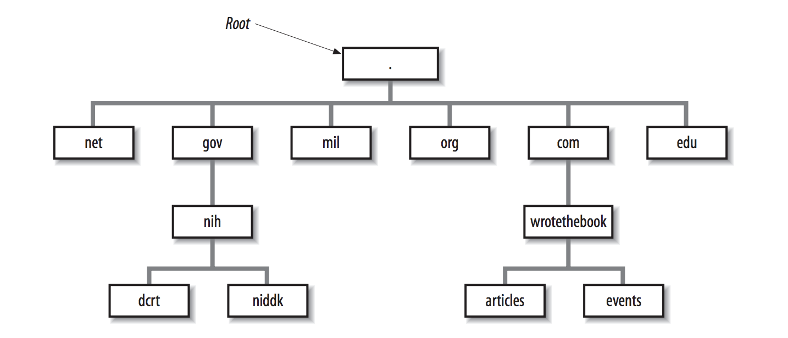
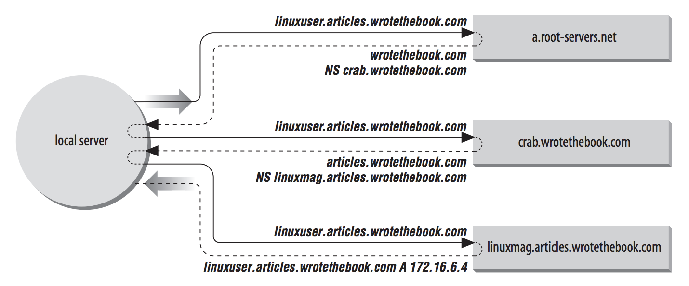
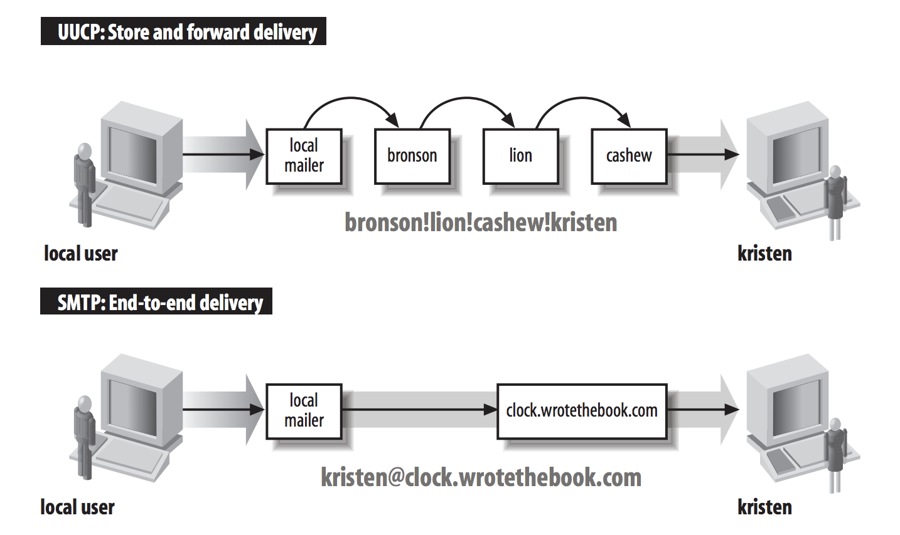

# Network Services

有一些網路 server 提供電腦與電腦之間必要的服務，跟其他應用程式不同，使用者不會直接存他們，反而電腦會使用這些服務來簡化安裝、設置、跟網路的操作。

server 會執行這些 function：

- Name service：轉換 IP address 到 hostname
- 設置 server：藉由設定 TCP/IP 的設定來簡化 networked host 的安裝
- email 的服務，讓 mail 透過網路從發送端送到接收端
- File server：允許 client 的電腦分享檔案
- Print server：允許使用者分享和維護 printer

在 TCP/IP network 上的 server 不應該跟傳統的 PC LAN server 混淆。在你的 network 上的每個 Unix host 可以同時是 server 和 client。在 TCP/IP network 上的 hosts 是 peers (同輩)。所有系統都相等，network 不會由任何一個 server 所決定。在這個章節討論的所有的 services 可以安裝在你 network 裡的多個系統上。

有些在你網路裡的東西是必要的服務。

## Names and Addresses

Internet Protocol 的文件定義了 name、address、route，如下：

> A name indicates what we seek. An address indicates where it is. A route indicates how to get there.

- Name 代表找尋什麼
- Address 代表他在哪裡
- Route 代表要如何到達

network 管理員需要注意 name、address、route。route 和 address 在前兩章節談論過。這個章節會討論 name，和他們是如何透過網路傳播的，每個在 TCP/IP 上的 network interface 是由唯一的 32-bit IP 地址辨識的。name 又稱作為 *hostname*，任何有 IP address 的設備都能給他一個 name。name 會指派到 device 上，因為比起數字的 網址，name 更容易記住且輸入正確。雖然在網路的軟體裡面不需要 name 的功能，但是有了他們會讓人們更簡單使用網路。

在大多樹的時候，hostnames 和數字的地址可以互相使用。像是一個使用個想要 telnet IP address 是 172.16.12.2 的工作站，可以輸入：

```shell
telnet 172.16.12.2
```

或是使用 hostname 關聯著 address，然後輸入相等的指令：

```shell
telnet rodent.wrotethebook.com
```

不論指令輸入的是 address 或是 hostname，network 的連線只會發生在 IP address 上，系統會在建立連線之前，把 hostname 轉換成 address。網路管理員負責將 name 指派給 address，然後把他們存在專門轉換的 database 裡面。

把 name 轉換成 address 不是簡單的 local issue。這個指令 `telnet rodent.wrotethebook.com` 必須在每個連上網路的 host 正常運作。如果 `rodent.wrotethebook.com` 連接到 Internet，那麼在這個世界上所有的 host 應該能把 `rodent.wrotethebook.com` 的 name 轉換成正確的 address。因此有些機構必須存在，為了傳播 name 的訊息給所有在網路上的 host。

有兩個常見的方法把 name 轉換成 address。比較舊的方法是簡單的查看 table 裡面的 hostname 又稱作為 *host table*。比較新的技術是使用分散式資料庫的系統，稱作為 *Domain Name System* (DNS) 來轉換。

## The Host Table

*host table* 是一個簡單的檔案，檔案將 IP address 聯繫著 hostname。在大多數的 Unix system，table 會存放在 */etc/hosts* 裡面。在 */etc/hosts* table 的每個 entry 會包含 IP address，IP address 跟 hostname 會用空白鍵分開。

在 *rodent* 的 host table 可能包含以下的 entry：

```
#
# Table of IP addresses and hostnames
#
172.16.12.2	rodent.wrotethebook.com rodent
127.0.0.1	localhost
172.16.12.1	crab.wrotethebook.com crab loghost
172.16.12.4	jerboas.wrotethebook.com jerboas
172.16.12.3	horseshoe.wrotethebook.com horseshoe
172.16.1.2	ora.wrotethebook.com ora
172.16.6.4	linuxuser.articles.wrotethebook.com linuxuser
```

第一個 entry 是給 *rodent* 自己。IP address 172.16.12.2 會聯繫著 hostname *rodent.wrotethebook.com* 或備用的 hostname (或 alias) *rodent*。hostname 和所有的別名會解析到相同的 IP address。

別名可以改變名稱、更短的 hostname。而且也允許 *generic hostname*。像是 entry 172.16.12.1。聯繫這個 address 的其中一個別名 *loghost*。*loghost* 是在 Solaris 設定檔 *syslog.conf* 特別使用的 hostname。有些系統會預先設定像是 `syslogd` 的程式，直接輸出到特定通用名字的 host。你可以藉由指派正確的通用名稱當做別名來輸出到 host 上。其他常見的 generic hostname 有 *lprhost*、*mailhost*、*dumphost*。

第二個 entry 是指派 127.0.0.1 的地址到 *localhost* 的 hostname。如同我們討論的，網址 127.0.0.0/8 是保留給 loopback 的 network。host address 127.0.0.1 是特殊的地址，用來指定給 local host 的 loopback address，因此 hostname 是 *localhost*。這個特殊的 addressing 慣例允許 host 給自己 address，跟給 remote host 的方法相同。loopback address 普遍簡化了同一份 code 裡面同時有 local 和 remote 的程式碼。這個 addressing 的慣例也減少網路流量，因為 localhost address 聯繫著 loopback 的 device，這個 device 會在資料被傳送到 network 之前送回 host。

雖然 host table 的系統已經被 DNS 取代了，但仍然還是廣泛地被使用，原因如下：

- 大多數的系統有小的 host table，host table 包含了關於 localhost network 上重要的 name 和 address。當 DNS 沒有在運行的時候就會使用 smail table，像是系統剛要開啟的時候。即使你有使用 DNS，你也應該要建立 */etc/hosts* 的設定檔給你的 host、*localhost* 和你區域網路的 *gateways* 和 server。

- 使用 NIS 的 site 會使用 host table 當作輸入來作為 NIS host database。你可以用 NIS 加上 DNS，但即使他們同時使用，大多數的 NIS site 也是會在 local network 上為每一個 host 建立 host table。第九章會解釋要如何一起使用 NIS 與 DNS

- 小到不會連到 Internet 的 site，有時候會使用 host table。如果只有很少的 local hosts 和很少修改關於這些 host 的 information，那麼沒有必要透過 TCP/IP 連線到 remote site，使用 DNS 沒有什麼優勢。

舊的 host table 不足給 global Internet 使用有兩個原因： 無法 scale 和缺少自動更新的程序。在 DNS 出現之前，叫做 Network Information Center (NIC) 的組織維護一個叫做 *NIC host table* 的 large table。在 table 裡的 host 又叫做 *registered hosts*，然後 NIC 把 Internet  上所有 site 的 hostname 跟 address 放到這個檔案裡。

甚至在 host table 是主要轉換 hostname 到 IP address 的方法，大多 site 只會註冊有限數量的 key systems。但即便是有限的註冊，table 的成長還是太多，以至於他變成一個沒有效率的轉換方式。沒有方法能有一個簡單的 table 提供足夠的服務給現今 Internet 上如此龐大數量的 hosts。

另一個 host table 系統的問題是缺少自動分散式註冊新的 host 的技術。只要 site 收到新的 host table 就可以依照 name 來指向給新的 registered host。但不保證會分散 host table 到 site，也不知道現在誰有這個 table 或誰做的。保證唯一性的分散式是 host table 這個系統主要的弱點。

## DNS

DNS 解決了 host table 的兩個弱點：

- DNS scale well。他不需要依賴單一的 large table。他是分散式的資料庫，當資料增加的時候不會變慢。DNS 現在提供了大約 100,000,000 個 hosts，只有少於 10,000 hosts 被列在 host table 裡。
- DNS 保證會把新的 host 的 information 傳遞到網路的任何一個地方，如果有人需要的話。

只有在對感興趣的 Information 會自動被傳播。如果 DNS server 收到一個是自己沒有任何 information 的 request，他會把 request 傳給 *authoritative server*。authoritative server 會負責維持 query domain information 的精準度。當 authoritative server 回應，local server 會 *saves* 或 *caches* 這個回應，讓之後可以使用。下次 local server 收到這個 information 的請求，就會自己的回應。控制從 authoritative 來的 host information，和自動傳遞正確的 information，讓 DNS 贏過了 host table，即使在沒有連線的網路裡也是。

DNS 取代了 host table 也取代早期的 name service。但不幸的是，新的和舊的服務都叫做 *name service*。兩個都列在 */etc/services*。舊的是 UDP port 42 稱作為 *nameserver* 或 *name*，DNS name service 是 port 53 稱作 *domain*。有時候會搞混這兩個 name server。但也不會，因為舊的已經過時了。當我們講到 name service 就是指 DNS。

#### The Domain Hierarchy

DNS 是一個分散式階層的系統，負責將 hostname 轉換成 IP address。在 DNS 之下，沒有集中式的資料庫有所有 Internet host 的資訊。這些資訊分散在數以千計的 name server 之中，很像是 Unix filesystem 階層架構。DNS 有一個 *root domain*，它位在 domain 階層中的最上面，服務一群 name server，叫做 *root servers*。

就像在 Unix filesystem 的資料夾找尋東西，會依照一個路徑，從 root 的資料夾，依序往下找，直到目標的資料夾。在 domain 裡面的資訊也是透過找尋 pointer 的方式，由上往下層找到目標。

在 root domain 下面的第一層是 *top-level domains*，分別有兩個基本的型態：geographic 和 organizational。geographic domains 會被建立在每個國家旁邊，
而且會用兩個字母代表國家代碼。因此，domain 的 type 又被稱作為 *country code top-level domain* (ccTLD)。舉例來說，英國的 ccTLD 是 *.uk*，日本是 *.jp*，美國是 *.us*，當 *.us* 當作為 top-level domain，second-level domain 通常是州。

在美國最有名的 top-level domain 是 organizational，在 domain 裡面的成員是基於某個組織的型態，像是商業、軍事。這些 domain 又稱作 *generic top-level domains* 或 *general-purpose top-level domains* (gTLDs)。

organizational 和 geographic domain 兩個完全沒有關聯，每個系統只會屬於這個個的其中一個。

像是下圖，最上面的是 root，在 root 下面的是 top-level domains。root server 對 top-level 有完整的資訊。沒有任何一台 server，甚至是 root server，都沒有完整的 domains 訊息，但是 root server 有 pointer 指向 second-level domains 的 server。



### Creating Domains and Subdomains

Internet Corporation for Assigned Names and Numbers (ICANN) 負責授權 domain name，他是一個非營利的組織，為了分配 domain name 和 IP address 而成立的。ICANN 已經授權的一些 registrars，你可以向這些 registrar 申請來獲得 domain，一但獲得授權，你就可以建立而外的 domains，又稱作為 *subdomains*。

指向到 name server 的 DNS database 的 record 是 NS (name server)，這個紀錄會包含 domain 的名字和 host 的名字。(第八章)

下圖描述了如何使用 NS records。local server 需要解析 *linuxuser.articles.wrotebook.com* 成為 IP address。但是 server 並沒有任何關於 *wrotebook.com* 資訊的 cache，所以他向 root server (*a.root-servers.net*) 詢問。root server 回應指向 *crab.wrotethebook.com* 的 NS record，作為 *wrotethebook.com* 資訊的來源。local server 詢問 *crab*，它指向 *linuxmag.articles.wrotethebook.com*，是 *articles.wrotethebook.com* 的 server。最後 local server 詢問 *linuxmag.articles.wrotethebook.com* 獲得 IP address。local server 會 cache 著 A (address) record 和 NS record，下一次他同樣要請求 *linuxmag.articles.wrotethebook.com* 的時候，就能自己回應自己。而且下次要拿 *wrotethebook.com* 的資訊，會直接到 *crab*，不會再經過 root server。

這個範例同時顯示了 recursive 和 nonrecursive 的 search，在 remote server 是 nonrecursive server，remote server 告訴 local server 要往哪裡走。local server 必須遵循著 pointer 走，所以是 recursive server。通常，root server 是 *nonrecursive* search，大多其他的 server 是 recursive search。



###  Domain Names

Domain names 反應了 domain 的階層。會由最具體的 (a hostname) 寫到最不具體的 (a top-level domain)，每一個部份都會用點分開。*fully qualified domain name* (FQDN) 會由 specific host 開始倒 top-level domain 結尾。*rodent.wrotethebook.com* 就是一個 *FQDN*。

Domian 並不一定要寫成 fully qualified domain names。他可以寫成相對 *default  domain*，就像 Unix 相對於現在的路徑。在建立 name server 的 query 的時候，DNS 會在使用者輸入的時候加上 default domain。舉例來說，如果你的 default domain 是 *wrotethebook.com*，使用者可以忽略 *wrotethebook.com*，只要你是在這個 domain 下的所有 hostname。*crab.wrotethebook.com* 可以簡單的寫成 *crab* 解決。DNS 會加上預設的 default domain *wrotethebook.com*。

在大多數的系統裡面，在 requested hostname 裡面沒有點的話，就會自動加上 default name。像是 *linuxuser.articles* 就不會被自動加上 default name。

會怎麼樣加上 default domain 和要如何建立 query，非常取決於軟體的設定。只有 fully qualified domain name 或 IP address 才不會被 name server 改動。

### BIND, Resolvers, and named

使用 Unix 系統實作的 DNS 是 *Berkeley Internet Name Domain* (BIND) 的軟體。接下來的描述是基於 BIND server 的實作。

DNS 軟體被分成兩個元件，resolver 和 name server。*resolver* 是建立詢問的軟體，他會發出問題。*name server* 會處理回應的程序，他會回答問題。

resolver 並不會獨自運行在電腦上，反而像是軟體裡面的 library，又稱作 *resolver code*，會附加在程式上，當需要的 lookup 網址的時候會使用它。

在 BIND 之下，所有的電腦都使用 resolver code，這些只負責詢問的系統又稱作為 *resolver-only* 系統。

BIND name server 會以一支程式獨自運行，稱作為 *named*。name servers 依照他不同的設定又被分成三個類別：

- Master：*master server* 又稱作 *primary server*，會紀錄 domain 的資料。master server 會載入 domain 管理員在磁碟上所建立的 domain 資訊。master server 是有 *authoritative*，意思是他有關於 domain 和 response  的完整訊息，且訊息永遠是準確的。一個 domain 應該只能有一個 master server。
- Slave：*slave server*s 又稱作為 *secondary servers*，他會從 master server 傳送整個 domain 的資料。特定的 domain 資料庫的檔案又稱作 *zone file*，複製這些檔案到 slave server 又稱作 *zone file transfer*。slave server 會週期的傳遞 domain zone file 來假定 slave server 有目前 domain 的資訊。
- Caching-only：*caching-only server* 會回應所有 name server 發出的詢問。一旦 caching server 收到詢問的 answer，他 cache 這個訊息，之後未來有相同回應的時候就會直接回傳。大多數的 name server 會 cache 回傳的訊息。讓 caching-only server 獨立的原因是因為，這是唯一能建立 domain 資料庫的技術。caching server 是 *non-authoritative*，意思是它們的訊息是二手的且不完全的，但通常是正確的。

在 server 裡不同的 type 之間的關係有優勢，對於大多數的 networks，DNS 比 host table 更有優勢，甚至非常小的網路。在 DNS 下，每個 domain 應該只能有一個 primary name server。domain 的管理員會把 DNS 資料傳入 primary server 的資料庫。管理員能集中控制 hostname 的資訊。當有新的 node 加入 network 的時候，你不需要修改 */etc/hosts*。你只需要修改 primary server 上的 DNS 資料庫，他會藉由 full zone transfer 或 caching single answer 傳遞到其他的 server。

### Network Information Service

Network Information Service (NIS) 是一個管理的資料庫系統，由 Sun Microsystem 所開發。他提供集中控制和自動傳送重要的管理檔案。NIS 可以和 DNS 一起使用，或取代 DNS。

NIS 和 DNS 有一些相同和不同的地方。像 DNS 的地方是，Network Information Service 解決的分散 host table 的準確度。但不像 DNS 的地方是，它提供區域網路的服務。NIS 不打算服務整個 Internet，另一個 NIS 不同的點是他提供更廣泛的資訓，比 DNS 提供更多 name-to-address 的 conversions。他能轉換很多標準的 Unix 檔案到資料庫，然後資料庫可以透過網路去請求。這些資料庫就稱作為 *NIS maps*。

NIS 轉換像是 */etc/hosts* 和 */etc/networks* 的檔案到 maps 裡。可以把 maps 儲存在集中的 server，當存取 NIS clients 的同時也能維護 server。因為 maps 可以同時集中式的維護和自動傳送訊息給使用者，NIS 克服了 host table 的弱點。但 NIS 並不能取代 DNS，因為 host table，因此 NIS 只包含部分對於 DNS 可用的資訊。因為這個原因，DNS 和 NIS 很常一起使用。

NIS 又稱作為 Yellow Pages 簡稱 yp，雖然名稱已經改了，但還是很常使用 yp。

## Mail Services

TCP/IP 提供了可靠且彈性的 email 系統，建立在幾個基本的 protocols 上。分別是 *Simple Mail Transfer Protocol* (SMTP)、*Post Office Protocol* (POP)、*Internet Message Access Protocol* (IMAP) 和 *Multipurpose Internet Mail Extensions* (MIME)。還有其他新功能的 TCP/IP mail protocols，但是沒有廣泛地使用。

接下來會分別介紹四個 protocols：

### Simple Mail Transfer Protocol

SMTP 是 TCP/IP mail delivery protocol。他會橫跨 Internet 和區域網路移動郵件。SMTP 定義在 RFC 821。他使用 port 25。下表示他常使用的指令：

| Command   | Syntax                                           | Function              |
| --------- | ------------------------------------------------ | --------------------- |
| Hello     | `HELO <sending-host>`<br />`EHLO <sending-host>` | Identify sending SMTP |
| From      | `MAIL FROM:<from-address>`                       | Sender address        |
| Recipient | `RCPT TO:<to-address>`                           | Recipient address     |
| Data      | `DATA`                                           | Begin a message       |
| Reset     | `RSET`                                           | Abort a message       |
| Verify    | `VRFY <string>`                                  | Verify a username     |
| Expand    | `EXPN <string>`                                  | Expand a mailing list |
| Help      | `HELP [string]`                                  | Request online help   |
| Quit      | `QUIT`                                           | End the SMTP session  |


```shell
$ telnet crab 25
Trying 172.16.12.1...
Connected to crab.wrotethebook.com.
Escape character is '^]'.
220 crab.wrotethebook.com ESMTP Sendmail 8.9.3+Sun/8.9.3; Thu, 19 Apr 2001 16:28:01-
0400 (EDT)
HELO rodent.wrotethebook.com
250 crab.wrotethebook.com Hello rodent [172.16.12.2], pleased to meet you
MAIL FROM:<daniel@rodent.wrotethebook.com>
250 <daniel@rodent.wrotethebook.com>... Sender ok
RCPT TO:<tyler@crab.wrotethebook.com>
250 <tyler@crab.wrotethebook.com>... Recipient ok
DATA
354 Enter mail, end with "." on a line by itself
Hi Tyler!
.
250 QAA00316 Message accepted for delivery
QUIT
221 crab.wrotethebook.com closing connection
Connection closed by foreign host.
```

設定從哪裡寄到哪裡，寫完信的結尾是一個 `.`。

有一些指令是後來新加的 SEND、SOML、SAML、TURN，定義在 RFC821，但不常使用。然後像是 HELP、VRFY、EXPN 通常是給使用者使用的，通訊的時候不會使用。

```shell
HELP
214-This is Sendmail version 8.9.3+Sun
214-Topics:
214- HELO EHLO MAIL RCPT DATA
214- RSET NOOP QUIT HELP VRFY
214- EXPN VERB ETRN DSN
214-For more info use "HELP <topic>".
214-For local information contact postmaster at this site.
214 End of HELP info
HELP RSET
214-RSET
214- Resets the system.
214 End of HELP info
VRFY <jane>
250 <jane@brazil.wrotethebook.com>
VRFY <mac>
250 Kathy McCafferty <<mac>>
EXPN <admin>
250-<sara@horseshoe.wrotethebook.com>
250 David Craig <<david>>
250-<tyler@wrotethebook.com>
```

HELP 看起並不是很有用。

VEFY 和 EXPN 可以看使用者的訊息，但因為安全性的原因通常會禁用他。`EXPN <admin>` 會列出管理員的信箱清單。`VRFY` 會詢問單一個使用者的訊息。像是上面的例子，mac 是本地端的使用者，輸入 `VRFY <mac>` 會回傳使用者帳戶的訊息。jane 是在 */etc/aliases* 檔案裡面的暱稱，他會回傳在檔案裡面找到的 email address。

上面這三個指令都很少在使用。

SMTP 提供 end-to-end 的信件傳送。其他的 mail 系統像是 UUCP 和 X.400，是使用 *store and forward* protocol 傳送信件的，每個 hop 都會儲存然後傳送給下一個 hop，直到目的地為止。



SMTP 直接傳送不需要依賴中介的 hosts。優點是如果傳送失敗的話，傳送端會立即知道，他可以通知使用者晚一點再傳送。缺點是需要兩邊使用者同時在線上。有些系統就沒有辦法處理這些東西，像是 PCs 或手機，在使用完之後就會關機，而且很高的機率是關機的，傳送端會顯示 cannont connect 的錯誤。通常會用 DNS 系統把信件傳送 mail server 替代直接傳遞的方式。只要 client 一上線，信件傳送的方式變成 server 傳送到 client 端。其中一個 TCP/IP netowork protocol 是 POP。

### Post Office Protocol

有兩個 Post Office Protocol 的版本：POP2 和 POP3。POP2 定義在 RFC 937 使用 port 109，POP3 定義在 RFC 1725 使用 port 110。這兩個 protocol 不兼容，因為他們使用不同的指令，雖然他們執行相同的基本 function。POP protocols 驗證使用者的帳號和密碼，然後把信件從 server 移動到 local 端。POP2 很少被使用，所以只講 POP3。

POP3 是一個簡單的 request/response 的 protocol，和 SMTP 一起使用，你可以輸入 POP3 的指令和 port 直接觀察：

```shell
% telnet crab 110
Trying 172.16.12.1 ...
Connected to crab.wrotethebook.com.
Escape character is '^]'.
+OK crab POP3 Server Process 3.3(1) at Mon 16-Apr-2001 4:48PM-EDT
USER hunt
+OK User name (hunt) ok. Password, please.
PASS Watts?Watt?
+OK 3 messages in folder NEWMAIL (V3.3 Rev B04)
STAT
+OK 3 459
RETR 1
+OK 146 octets
...The full text of message 1...
DELE 1
+OK message # 1 deleted
RETR 2
+OK 155 octets
...The full text of message 2...
DELE 2
+OK message # 2 deleted
RETR 3
+OK 158 octets
...The full text of message 3...
DELE 3
+OK message # 3 deleted
QUIT
+OK POP3 crab Server exiting (0 NEWMAIL messages left) Connection closed by foreign
host.
```

`USER` 和 `PASS` 分別是帳號跟密碼，用來登入 mail server。`STAT` 知道有幾封信跟所有檔案大小。`RETR` 和 `DELE` 分別看每一封信的內容和刪除。

| Command         | Function                                         |
| --------------- | ------------------------------------------------ |
| `USER username` | The user’s account name                          |
| `PASS password` | The user’s password                              |
| `STAT`          | Display the number of unread messages/bytes      |
| `RETR n`        | Retrieve message number n                        |
| `DELEn`         | Delete message numbern                           |
| `LAST`          | Display the number of the last message accessed  |
| `LIST [n]`      | Display the size of messagen or of all messages  |
| `RSET`          | Undelete all messages; reset message number to 1 |
| `TOP n`         | Print the headers andl lines of messagen         |
| `NOOP`          | Do nothing                                       |
| `QUIT`          | End the POP3 session                             |


`RETR` 和 `DELE` 用數字代表信件的訊息，在兩個信件並沒有直接的連接。所以有可能沒有讀取資料之前就先刪除，POP client 通常不會這樣使用。POP server 會把整個資料從 server 移動到 client 端，即使被刪除了或從來沒有開過。這樣在 client 端刪除了訊息也不會影響到 server。如果 email client 端想要控制 server 的信箱，通常會使用 IMAP。

### Internet Message Access Protocol

Internet Message Access Protocol (IMAP) 代替了 POP。他有和 POP 一樣基本的服務，還加了 mailbox 同步的新功能，這個功能能夠在 client 和 server 端獨自的開啟信件，同時保持兩邊系統保持最新。IMAP 能夠同時在 client 和 server 端操作各自的信件，這些改變反映在兩邊的系統。

IMAP 使用 TCP 傳送資料，port 是 143 (IMAP3 的 port 是 220，IMAP2 和 IMAP 4 都是 143)。跟 POP protocol 一樣，IMAP 也是用 request/response protocol。IMAP 的指令集比 POP 更複雜一些，但是少於 25 個指令，這些指令定義在 RFC 2060。

| Command        | Function                                                     |
| -------------- | ------------------------------------------------------------ |
| `CAPABILITY`   | List the features supported by the server                    |
| `NOOP`         | Literally “No Operation”                                     |
| `LOGOUT`       | Close the connection                                         |
| `AUTHENTICATE` | Request an alternate authentication method                   |
| `LOGIN`        | Provide the username and password for plain-text authentication |
| `SELECT`       | Open a mailbox                                               |
| `EXAMINE`      | Open a mailbox as read-only                                  |
| `CREATE`       | Create a new mailbox                                         |
| `DELETE`       | Remove a mailbox                                             |
| `RENAME`       | Change the name of a mailbox                                 |
| `SUBSCRIBE`    | Add a mailbox to the list of active mailboxes                |


這個 protocol 設計用來遠端維護儲存在 server 裡的 mailbox。

```shell
$ telnet localhost 143
Trying 127.0.0.1...
Connected to rodent.wrotethebook.com.
Escape character is '^]'.
* OK rodent.wrotethebook.com IMAP4rev1 v12.252 server ready
a0001 LOGIN craig Wats?Watt?
a0001 OK LOGIN completed
a0002 SELECT inbox
* 3 EXISTS
* 0 RECENT
* OK [UIDVALIDITY 965125671] UID validity status
* OK [UIDNEXT 5] Predicted next UID
* FLAGS (\Answered \Flagged \Deleted \Draft \Seen)
* OK [PERMANENTFLAGS (\* \Answered \Flagged \Deleted \Draft \Seen)] Permanent flags
* OK [UNSEEN 1] first unseen message in /var/spool/mail/craig
a0002 OK [READ-WRITE] SELECT completed
a0003 FETCH 1 BODY[TEXT]
* 1 FETCH (BODY[TEXT] {1440}
... an e-mail message that is 1440 bytes long ...
* 1 FETCH (FLAGS (\Seen))
a0003 OK FETCH completed
a0004 STORE 1 +FLAGS \DELETED
* 1 FETCH (FLAGS (\Seen \Deleted))
a0004 OK STORE completed
a0005 CLOSE
a0005 OK CLOSE completed
a0006 LOGOUT
* BYE rodent.wrotethebook.com IMAP4rev1 server terminating connection
a0006 OK LOGOUT completed
Connection closed by foreign host.
```

LOGIN 指令會驗證 */etc/passwd* 裡面的使用者。最前面的 `A0001` 是 tag，每一個指令只會有一個唯一的 id，每個指令前面都會有這個 tag。

IMAP 是 mailbox 導向的 protocol。SELECT 指令會選擇一個 mailbox，範例中的 mailbox 是 "index"，裡面有 flags 可以用來管理 mailbox 裡的 message，透過 Seen、Unseen、Deleted。

FETCH 會從 mailbox 下載 message，然後可以看到你平常在看的信件。

之後使用者要刪除他，可以使用 STORE 指令加上 Delete flag。因為 DELETE 這個指令會刪除整個 mailbox，而不是單一則訊息。在下完指令後並不會立即刪除，除非使用者下了 EXPUNGE 的指令或是使用 CLOSE 指令關閉 mailbox。最後使用 LOGOUT 登出。

IMAP 明顯的比 POP 更複雜。如果你 imapd (IMAP Server) 建立的話，就能使用上面的指令去手動測試。

### Multipurpose Internet Mail Extensions

快速帶過最新的 email protocol 是 *Multipurpose Internet Mail Extensions* (MIME)。MIME 是當前 TCP/IP mail 系統的延伸，而不是為了要取代 TCP/IP mail 系統。MIME 比較關心的是信箱系統的傳送，而不是傳送的機制。MIME 並沒有要取代 SMTP 或是 TCP，而是擴充了一些構成信件的定義。

RFC 822 定義了一組廣泛使用的 mail headers，讓大多沒有使用 SMTP 的信件系統也能使用。因為它提供了信件的轉譯和傳送，對 email 來說非常有利。

- 支援不同資料型態。在 RFC821 和 RFC822 在傳送時是 7-bit ASCII，雖然能滿足大多數的英文字母，但是不支援更多 bit 的語言，也不支援二件味的資料。
- 支援更複雜的 message body。RFC 822 並沒有詳細描述 body 的格式，而注重於信件的 header。

MIME 解決了這兩個弱點，攜帶不同格式資料和定義信件的 body 讓單一個 message 能攜帶多個物件。RFC1521 *Multipurpose Internet Mail Extensions Part One: Format of Internet Message Bodies* 定義兩個 header，給定 mail message body 的結構和允許攜帶不同型態的資料，分別是 *Content-Type* 和 *Content-Transfer-Encoding* header。

*Content-Type* header 定義資料會被傳送的型態，這個 header 會有 Subtype 的欄位可以精確定義。最新的 subtype 會可以從在 [RFC](https://www.iana.org/assignments/media-types/media-types.xhtml) 獲得，最原始的 RFC 定義七個 content type 和一些 subtypes。

- *text*：文字資料。RFC1521 定義文字的 subtypes 有 *plain* 和 *richtext*。現在已經超過 30 個 subtype，包括 *enriched*、*xml*、*html*。
- *application*：二進位資料。定義在 RFC1521 裡的主要 subtype 是 *octet-stream*，這是一串 8-bit 二進位的資料。超過 200 個 subtype 定義在這裡面。
- *image*：靜止的圖片。兩個 subtype 定義在 RFC1521：*jpeg* 和 *gif*。已經超過 20 個 subtype 像是 *tiff*、*cgm*、*g3fax*。
- *video*：動態的圖片。最早定義 *mpeg*，是最早廣泛使用的標準，其他格式像是 *quicktime* 也已經被加入了。
- *audio*：聲音資料。最早定義的是 *basic*，聲音會透過 pulse code modulation (PCM) 加密，現在已經加入 20 個聲音的型態，像是 *MP4A-LATM*。
- *multipart*：

